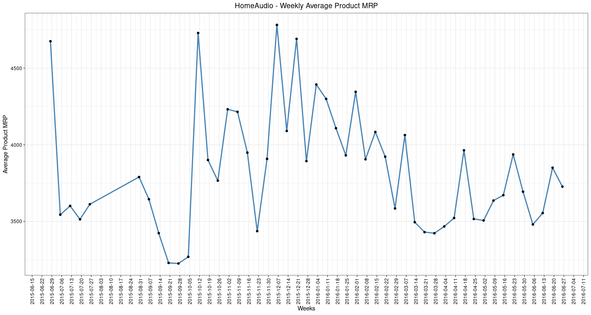

Market Mix Modelling - Data Preparation and EDA
================

### **1. Business Understanding**

ElecKart is an e-commerce firm specializing in electronic products. Over
the last one year, they had spent a significant amount of money in
marketing. They also offered big-ticket promotions.

They are about to create a marketing budget for the next year which
includes spending on commercials, online campaigns, and pricing &
promotion strategies.

### **2. Objective**

The aim is to develop a market mix model to observe the actual impact of
different marketing variables over the last year.Basically needs to
optimize the marketing levers to improve the revenue response.

#### **2.1. Below are the data or variables needs to be consider for analysis**

1.  Products Sales data
2.  Media Investment
3.  NPS Score
4.  Special Sale days \[Holidays\]

### **3. Data Understanding**

#### **3.1. Load Libraries**

``` r
library(readxl)
library(lubridate)
library(ggplot2)
library(scales)
library(ggthemes)
library(cowplot)
library(dplyr)
library(zoo)
library(DataCombine)
library(imputeTS)
library(MASS)
library(car)
library(DAAG)
library(knitr)
```

#### **3.2. Data Load**

``` r
eleckart <- read.csv("ConsumerElectronics.csv", stringsAsFactors = F)
media_investment <- read_excel("Media data and other information.xlsx", sheet = "Media Investment", skip = 2)
nps <- read_excel("Media data and other information.xlsx", sheet = "Monthly NPS Score", skip =2, col_names = FALSE)
```

``` r
kable(eleckart[1:10, ])
```

| fsn\_id          | order\_date         | Year | Month |    order\_id | order\_item\_id |  gmv | units | deliverybdays | deliverycdays | s1\_fact.order\_payment\_type | sla |      cust\_id |       pincode | product\_analytic\_super\_category | product\_analytic\_category | product\_analytic\_sub\_category | product\_analytic\_vertical | product\_mrp | product\_procurement\_sla |
|:-----------------|:--------------------|-----:|------:|-------------:|----------------:|-----:|------:|:--------------|:--------------|:------------------------------|----:|--------------:|--------------:|:-----------------------------------|:----------------------------|:---------------------------------|:----------------------------|-------------:|--------------------------:|
| ACCCX3S58G7B5F6P | 2015-10-17 15:11:54 | 2015 |    10 | 3.419301e+15 |    3.419301e+15 | 6400 |     1 |               |               | COD                           |   5 | -1.012991e+18 | -7.791756e+18 | CE                                 | CameraAccessory             | CameraAccessory                  | CameraTripod                |         7190 |                         0 |
| ACCCX3S58G7B5F6P | 2015-10-19 10:07:22 | 2015 |    10 | 1.420831e+15 |    1.420831e+15 | 6900 |     1 |               |               | COD                           |   7 | -8.990325e+18 |  7.335411e+18 | CE                                 | CameraAccessory             | CameraAccessory                  | CameraTripod                |         7190 |                         0 |
| ACCCX3S5AHMF55FV | 2015-10-20 15:45:56 | 2015 |    10 | 2.421913e+15 |    2.421913e+15 | 1990 |     1 |               |               | COD                           |  10 | -1.040443e+18 | -7.477688e+18 | CE                                 | CameraAccessory             | CameraAccessory                  | CameraTripod                |         2099 |                         3 |
| ACCCX3S5AHMF55FV | 2015-10-14 12:05:15 | 2015 |    10 | 4.416592e+15 |    4.416592e+15 | 1690 |     1 |               |               | Prepaid                       |   4 | -7.604961e+18 | -5.835932e+18 | CE                                 | CameraAccessory             | CameraAccessory                  | CameraTripod                |         2099 |                         3 |
| ACCCX3S5AHMF55FV | 2015-10-17 21:25:03 | 2015 |    10 | 4.419525e+15 |    4.419525e+15 | 1618 |     1 |               |               | Prepaid                       |   6 |  2.894557e+18 |  5.347354e+17 | CE                                 | CameraAccessory             | CameraAccessory                  | CameraTripod                |         2099 |                         3 |
| ACCCX3S5JGAJETYR | 2015-10-17 12:07:24 | 2015 |    10 | 3.419189e+15 |    3.419189e+15 | 3324 |     1 |               |               | Prepaid                       |   5 | -7.641546e+18 | -1.919053e+18 | CE                                 | CameraAccessory             | CameraAccessory                  | CameraTripod                |         4044 |                         5 |
| ACCCX3S5JGAJETYR | 2015-10-16 14:59:57 | 2015 |    10 | 3.418429e+15 |    3.418429e+15 | 3695 |     1 |               |               | Prepaid                       |   6 | -7.156140e+16 |  6.404913e+18 | CE                                 | CameraAccessory             | CameraAccessory                  | CameraTripod                |         4044 |                         5 |
| ACCCX3S5JGAJETYR | 2015-10-15 23:41:39 | 2015 |    10 | 3.417799e+15 |    3.417799e+15 | 3695 |     1 |               |               | COD                           |   5 |  9.173276e+18 | -1.606303e+18 | CE                                 | CameraAccessory             | CameraAccessory                  | CameraTripod                |         4044 |                         5 |
| ACCCX3S5JGAJETYR | 2015-10-16 00:49:14 | 2015 |    10 | 2.417870e+15 |    2.417870e+15 |   NA |     1 |               |               | Prepaid                       |   9 |            NA |            NA | CE                                 | CameraAccessory             | CameraAccessory                  | CameraTripod                |         4044 |                         5 |
| ACCCX3S5JGAJETYR | 2015-10-25 22:52:34 | 2015 |    10 | 4.426482e+15 |    4.426482e+15 | 3695 |     1 |               |               | COD                           |   7 | -7.809156e+18 | -9.779010e+17 | CE                                 | CameraAccessory             | CameraAccessory                  | CameraTripod                |         4044 |                         5 |

### **4.Data Preparation**

#### **4.1. Converting the “media\_investment” dataframe into weekly level spends on advertising channels (originally it hold monthly investment)**

##### **4.1.1. computing Month, week, and no.of days per week (month, week)**

``` r
days <- seq(as.Date("2015-07-01"),as.Date("2016-06-30"),'days')
weekdays <- data.frame('days'=days, Month = month(days), week = week(days),nweek = rep(1,length(days)))
weekdays <- data.frame(weekdays %>% group_by(Month,week) %>% summarise(nweeks = sum(nweek)))
weekdays$fracDays <- weekdays$nweeks/7
```

##### **4.1.2. Replacing NA values**

``` r
media_investment[is.na(media_investment)] <- 0
```

##### **4.1.3. converting montly spend to weekly**

``` r
media_investment <- cbind(Month=media_investment[,c(2)], media_investment[,-c(1,2)]/4.30)
```

##### **4.1.4. Add weekly information**

``` r
media_investment_weekly <- merge(weekdays,media_investment, by='Month', all.x = TRUE)
```

##### **4.1.5. Converting media Investment at weekly granularity**

###### **4.1.5.1. pro-rate weekly investment as per the ratio of its days span over adjacent months**

``` r
media_investment_weekly_final <- data.frame(media_investment_weekly %>% group_by(week) %>% 
                    summarise(Total_Investment = sum(`Total Investment`*fracDays),
                    TV = sum(TV*fracDays), Digital=sum(Digital*fracDays),Sponsorship = sum(Sponsorship*fracDays), 
                    Content_Marketing = sum(`Content Marketing`*fracDays),Online_Marketing = sum(`Online marketing`*fracDays), 
                    Affiliates = sum(Affiliates*fracDays), SEM = sum(SEM*fracDays), Radio = sum(Radio*fracDays), 
                    Other = sum(Other*fracDays)))
```

##### **4.1.6. Converting media investment into crores**

``` r
media_investment_weekly_final[,2:11] <- media_investment_weekly_final[,2:11]*10000000
```

#### **4.2. Converting the ‘nps’ dataframe into weekly level**

##### **4.2.1. Re-naming the nps dataframe column name**

``` r
colnames(nps) <- c(0:12)
```

###### **4.2.2. adding two rows in nps dataframe to add ‘Year’ and ‘Month’**

``` r
nps <- rbind(nps, c(0,2015,2015,2015,2015,2015, 2015,2016,2016,2016,2016,2016,2016), c(0,7,8,9,10,11,12,1,2,3,4,5,6))
```

##### **4.2.4. Taking the transpose of the nps dataframe (i.e. converting rows to column and vice-versa)**

``` r
nps = setNames(data.frame(t(nps[,-1])), nps[,1])
```

##### **4.2.5. Re-naming the header of nps dataframe**

``` r
colnames(nps) <- c("NPS Score","Year","Month")
```

##### **4.2.6. Rounding off the numerical value to one place of decimal**

``` r
nps[,'NPS Score']=round(nps[,'NPS Score'],1)
```

#### **4.3. Checking whether the data is between “July 2015 to June 2016”**

``` r
table(eleckart$Year, eleckart$Month)
```

    ##       
    ##             1      2      3      4      5      6      7      8      9     10
    ##   2015      0      0      0      0      1      6  88683    271 209202 207301
    ##   2016 143768 144084 153299 134390 157071 121792    602      0      0      0
    ##       
    ##            11     12
    ##   2015 130203 158151
    ##   2016      0      0

``` r
# Data is present for 2015- May & June and 2016- July
```

#### **4.4. Fiilerting out the May, JUne 2015 and July 2016 data**

``` r
eleckart_filtered <- subset(eleckart, !(Month ==5 & Year==2015 | Month ==6 & Year==2015 | Month ==7 & Year==2016))
table(eleckart_filtered$Year, eleckart_filtered$Month)
```

    ##       
    ##             1      2      3      4      5      6      7      8      9     10
    ##   2015      0      0      0      0      0      0  88683    271 209202 207301
    ##   2016 143768 144084 153299 134390 157071 121792      0      0      0      0
    ##       
    ##            11     12
    ##   2015 130203 158151
    ##   2016      0      0

#### **4.5. Filtering out the duplicate records based on the columns \[“order\_date”, “order\_id”, “order\_item\_id” and “units”\]**

``` r
eleckart_filtered <- eleckart_filtered[!duplicated(eleckart_filtered[c(1,5,6,8)]),]
```

#### **4.6. Filtering out the rows/order where Product\_MRP is ‘0’**

``` r
eleckart_filtered <- subset(eleckart_filtered, product_mrp != 0)
```

#### **4.7. Replacing the ‘gmv’ with product\_mrp\*units wherever gmv=0 (assuming products were sold without any discount)**

``` r
row_no <- which(eleckart_filtered$gmv==0)
      
for(i in 1:length(row_no)){
  eleckart_filtered$gmv[row_no[i]] <- (eleckart_filtered$product_mrp[row_no[i]])*(eleckart_filtered$units[row_no[i]])
}
```

#### **4.8. Filtering out the records where ‘gmv’ is greater than ‘product\_mrp\*units’ (as we can’t charge more than MRP)**

``` r
eleckart_filtered <- subset(eleckart_filtered, (product_mrp*units) >= gmv)
```

#### **4.9. Converting the order\_date to the “Date” format**

``` r
eleckart_filtered$order_date <- as.Date(eleckart_filtered$order_date)
```

#### **4.10. Converted order\_date in to Date format and creted as new column in order to perform analysis based on the Year and Month**

``` r
eleckart_filtered$month_date <- as.Date(cut(eleckart_filtered$order_date,breaks = "month"))
```

#### **4.11. Derived a column “wday” from the order\_date to find the day of a week**

``` r
eleckart_filtered$wday <- weekdays(eleckart_filtered$order_date)
```

#### **4.12. Derived a column “week” from the order\_date (it gives the week number i.e. 1, 2 etc.)**

``` r
eleckart_filtered$week <- as.numeric(strftime(eleckart_filtered$order_date, format = "%V"))
```

#### **4.13. Derived a column “week\_date” from the order\_date (it gives the starting date of the week)**

``` r
eleckart_filtered$Week_date <- as.Date(cut(eleckart_filtered$order_date,breaks = "week", start.on.monday = FALSE))  # changes weekly break point to Sunday
```

#### **4.14. Creating a vector “date” to store the dates of Special Sale Calender as provided in the ‘Media data and other information.xlsx’**

``` r
date <- as.Date(c("2015-07-18","2015-07-19","2015-08-15","2015-08-16","2015-08-17","2015-08-28","2015-08-29","2015-08-30","2015-10-15","2015-10-16","2015-10-17",
                "2015-11-07","2015-11-08","2015-11-09","2015-11-10","2015-11-11","2015-11-12","2015-11-13","2015-11-14","2015-12-25","2015-12-26","2015-12-27",
                "2015-12-28","2015-12-29","2015-12-30","2015-12-31","2016-01-01","2016-01-02","2016-01-03","2016-01-20","2016-01-21","2016-01-22","2016-02-01",
                "2016-02-02","2016-02-14","2016-02-15","2016-02-20","2016-02-21","2016-03-07","2016-03-08","2016-03-09","2016-05-25","2016-05-26","2016-05-27"))
```

##### **4.14.1. Creating a column whether a order is placed on special sale day or not**

``` r
eleckart_filtered$is_special_sale_day <- ifelse(eleckart_filtered$order_date %in% date, "Y", "N")
```

##### **4.14.2. Creating one more column “special\_sale\_day” which stores which special day it was (like Diwali, Eid etc.)**

``` r
eleckart_filtered$special_sale_day='Regular Day'
      
eleckart_filtered <- within(eleckart_filtered, {
        special_sale_day[order_date  %in% (date[1:2])]='Eid & Rathayatra'
        special_sale_day[order_date  %in% (date[3:5])]='Independence Day'
        special_sale_day[order_date  %in% (date[6:8])]='Rakshabandhan'
        special_sale_day[order_date  %in% (date[9:11])]='Daussera'
        special_sale_day[order_date  %in% (date[12:19])]='Diwali'
        special_sale_day[order_date  %in% (date[20:29])]='Christmas & New Year'
        special_sale_day[order_date  %in% (date[30:32])]='Republic Day'
        special_sale_day[order_date  %in% (date[33:34])]='BED'
        special_sale_day[order_date  %in% (date[35:36])]='Valentine Day'
        special_sale_day[order_date  %in% (date[37:38])]='FHSD'
        special_sale_day[order_date  %in% (date[39:41])]='BSD'
        special_sale_day[order_date  %in% (date[42:44])]='Pacman'
})
```

##### **4.14.3. Creating a dataframe which holds the number of holidays per week**

``` r
holidays <- date   #Coverting the date vector into Date format
week <- strftime(holidays, format = "%V")   #Extracting the weeks out of date
Year <- format(as.POSIXct(holidays, format="%Y-%m-%d"),"%Y")  #Extracting the Year out of date
      
holiday_details <- data.frame(cbind(Year,week))   #Creating a dataframe to hold holiday details
holiday_details$holidays <- holidays
holiday_details$holiday_count <- 1
holiday_details <- aggregate(holiday_count~Year+week, holiday_details, sum)   #Aggregating the holidays couns based on week
```

#### **4.15. Checking for the “units” column in case of any outlier**

``` r
quantile(eleckart_filtered$units, seq(0,1,.001))  #99.9% of orders/records have <=4 units
```

    ##   0.0%   0.1%   0.2%   0.3%   0.4%   0.5%   0.6%   0.7%   0.8%   0.9%   1.0% 
    ##      1      1      1      1      1      1      1      1      1      1      1 
    ##   1.1%   1.2%   1.3%   1.4%   1.5%   1.6%   1.7%   1.8%   1.9%   2.0%   2.1% 
    ##      1      1      1      1      1      1      1      1      1      1      1 
    ##   2.2%   2.3%   2.4%   2.5%   2.6%   2.7%   2.8%   2.9%   3.0%   3.1%   3.2% 
    ##      1      1      1      1      1      1      1      1      1      1      1 
    ##   3.3%   3.4%   3.5%   3.6%   3.7%   3.8%   3.9%   4.0%   4.1%   4.2%   4.3% 
    ##      1      1      1      1      1      1      1      1      1      1      1 
    ##   4.4%   4.5%   4.6%   4.7%   4.8%   4.9%   5.0%   5.1%   5.2%   5.3%   5.4% 
    ##      1      1      1      1      1      1      1      1      1      1      1 
    ##   5.5%   5.6%   5.7%   5.8%   5.9%   6.0%   6.1%   6.2%   6.3%   6.4%   6.5% 
    ##      1      1      1      1      1      1      1      1      1      1      1 
    ##   6.6%   6.7%   6.8%   6.9%   7.0%   7.1%   7.2%   7.3%   7.4%   7.5%   7.6% 
    ##      1      1      1      1      1      1      1      1      1      1      1 
    ##   7.7%   7.8%   7.9%   8.0%   8.1%   8.2%   8.3%   8.4%   8.5%   8.6%   8.7% 
    ##      1      1      1      1      1      1      1      1      1      1      1 
    ##   8.8%   8.9%   9.0%   9.1%   9.2%   9.3%   9.4%   9.5%   9.6%   9.7%   9.8% 
    ##      1      1      1      1      1      1      1      1      1      1      1 
    ##   9.9%  10.0%  10.1%  10.2%  10.3%  10.4%  10.5%  10.6%  10.7%  10.8%  10.9% 
    ##      1      1      1      1      1      1      1      1      1      1      1 
    ##  11.0%  11.1%  11.2%  11.3%  11.4%  11.5%  11.6%  11.7%  11.8%  11.9%  12.0% 
    ##      1      1      1      1      1      1      1      1      1      1      1 
    ##  12.1%  12.2%  12.3%  12.4%  12.5%  12.6%  12.7%  12.8%  12.9%  13.0%  13.1% 
    ##      1      1      1      1      1      1      1      1      1      1      1 
    ##  13.2%  13.3%  13.4%  13.5%  13.6%  13.7%  13.8%  13.9%  14.0%  14.1%  14.2% 
    ##      1      1      1      1      1      1      1      1      1      1      1 
    ##  14.3%  14.4%  14.5%  14.6%  14.7%  14.8%  14.9%  15.0%  15.1%  15.2%  15.3% 
    ##      1      1      1      1      1      1      1      1      1      1      1 
    ##  15.4%  15.5%  15.6%  15.7%  15.8%  15.9%  16.0%  16.1%  16.2%  16.3%  16.4% 
    ##      1      1      1      1      1      1      1      1      1      1      1 
    ##  16.5%  16.6%  16.7%  16.8%  16.9%  17.0%  17.1%  17.2%  17.3%  17.4%  17.5% 
    ##      1      1      1      1      1      1      1      1      1      1      1 
    ##  17.6%  17.7%  17.8%  17.9%  18.0%  18.1%  18.2%  18.3%  18.4%  18.5%  18.6% 
    ##      1      1      1      1      1      1      1      1      1      1      1 
    ##  18.7%  18.8%  18.9%  19.0%  19.1%  19.2%  19.3%  19.4%  19.5%  19.6%  19.7% 
    ##      1      1      1      1      1      1      1      1      1      1      1 
    ##  19.8%  19.9%  20.0%  20.1%  20.2%  20.3%  20.4%  20.5%  20.6%  20.7%  20.8% 
    ##      1      1      1      1      1      1      1      1      1      1      1 
    ##  20.9%  21.0%  21.1%  21.2%  21.3%  21.4%  21.5%  21.6%  21.7%  21.8%  21.9% 
    ##      1      1      1      1      1      1      1      1      1      1      1 
    ##  22.0%  22.1%  22.2%  22.3%  22.4%  22.5%  22.6%  22.7%  22.8%  22.9%  23.0% 
    ##      1      1      1      1      1      1      1      1      1      1      1 
    ##  23.1%  23.2%  23.3%  23.4%  23.5%  23.6%  23.7%  23.8%  23.9%  24.0%  24.1% 
    ##      1      1      1      1      1      1      1      1      1      1      1 
    ##  24.2%  24.3%  24.4%  24.5%  24.6%  24.7%  24.8%  24.9%  25.0%  25.1%  25.2% 
    ##      1      1      1      1      1      1      1      1      1      1      1 
    ##  25.3%  25.4%  25.5%  25.6%  25.7%  25.8%  25.9%  26.0%  26.1%  26.2%  26.3% 
    ##      1      1      1      1      1      1      1      1      1      1      1 
    ##  26.4%  26.5%  26.6%  26.7%  26.8%  26.9%  27.0%  27.1%  27.2%  27.3%  27.4% 
    ##      1      1      1      1      1      1      1      1      1      1      1 
    ##  27.5%  27.6%  27.7%  27.8%  27.9%  28.0%  28.1%  28.2%  28.3%  28.4%  28.5% 
    ##      1      1      1      1      1      1      1      1      1      1      1 
    ##  28.6%  28.7%  28.8%  28.9%  29.0%  29.1%  29.2%  29.3%  29.4%  29.5%  29.6% 
    ##      1      1      1      1      1      1      1      1      1      1      1 
    ##  29.7%  29.8%  29.9%  30.0%  30.1%  30.2%  30.3%  30.4%  30.5%  30.6%  30.7% 
    ##      1      1      1      1      1      1      1      1      1      1      1 
    ##  30.8%  30.9%  31.0%  31.1%  31.2%  31.3%  31.4%  31.5%  31.6%  31.7%  31.8% 
    ##      1      1      1      1      1      1      1      1      1      1      1 
    ##  31.9%  32.0%  32.1%  32.2%  32.3%  32.4%  32.5%  32.6%  32.7%  32.8%  32.9% 
    ##      1      1      1      1      1      1      1      1      1      1      1 
    ##  33.0%  33.1%  33.2%  33.3%  33.4%  33.5%  33.6%  33.7%  33.8%  33.9%  34.0% 
    ##      1      1      1      1      1      1      1      1      1      1      1 
    ##  34.1%  34.2%  34.3%  34.4%  34.5%  34.6%  34.7%  34.8%  34.9%  35.0%  35.1% 
    ##      1      1      1      1      1      1      1      1      1      1      1 
    ##  35.2%  35.3%  35.4%  35.5%  35.6%  35.7%  35.8%  35.9%  36.0%  36.1%  36.2% 
    ##      1      1      1      1      1      1      1      1      1      1      1 
    ##  36.3%  36.4%  36.5%  36.6%  36.7%  36.8%  36.9%  37.0%  37.1%  37.2%  37.3% 
    ##      1      1      1      1      1      1      1      1      1      1      1 
    ##  37.4%  37.5%  37.6%  37.7%  37.8%  37.9%  38.0%  38.1%  38.2%  38.3%  38.4% 
    ##      1      1      1      1      1      1      1      1      1      1      1 
    ##  38.5%  38.6%  38.7%  38.8%  38.9%  39.0%  39.1%  39.2%  39.3%  39.4%  39.5% 
    ##      1      1      1      1      1      1      1      1      1      1      1 
    ##  39.6%  39.7%  39.8%  39.9%  40.0%  40.1%  40.2%  40.3%  40.4%  40.5%  40.6% 
    ##      1      1      1      1      1      1      1      1      1      1      1 
    ##  40.7%  40.8%  40.9%  41.0%  41.1%  41.2%  41.3%  41.4%  41.5%  41.6%  41.7% 
    ##      1      1      1      1      1      1      1      1      1      1      1 
    ##  41.8%  41.9%  42.0%  42.1%  42.2%  42.3%  42.4%  42.5%  42.6%  42.7%  42.8% 
    ##      1      1      1      1      1      1      1      1      1      1      1 
    ##  42.9%  43.0%  43.1%  43.2%  43.3%  43.4%  43.5%  43.6%  43.7%  43.8%  43.9% 
    ##      1      1      1      1      1      1      1      1      1      1      1 
    ##  44.0%  44.1%  44.2%  44.3%  44.4%  44.5%  44.6%  44.7%  44.8%  44.9%  45.0% 
    ##      1      1      1      1      1      1      1      1      1      1      1 
    ##  45.1%  45.2%  45.3%  45.4%  45.5%  45.6%  45.7%  45.8%  45.9%  46.0%  46.1% 
    ##      1      1      1      1      1      1      1      1      1      1      1 
    ##  46.2%  46.3%  46.4%  46.5%  46.6%  46.7%  46.8%  46.9%  47.0%  47.1%  47.2% 
    ##      1      1      1      1      1      1      1      1      1      1      1 
    ##  47.3%  47.4%  47.5%  47.6%  47.7%  47.8%  47.9%  48.0%  48.1%  48.2%  48.3% 
    ##      1      1      1      1      1      1      1      1      1      1      1 
    ##  48.4%  48.5%  48.6%  48.7%  48.8%  48.9%  49.0%  49.1%  49.2%  49.3%  49.4% 
    ##      1      1      1      1      1      1      1      1      1      1      1 
    ##  49.5%  49.6%  49.7%  49.8%  49.9%  50.0%  50.1%  50.2%  50.3%  50.4%  50.5% 
    ##      1      1      1      1      1      1      1      1      1      1      1 
    ##  50.6%  50.7%  50.8%  50.9%  51.0%  51.1%  51.2%  51.3%  51.4%  51.5%  51.6% 
    ##      1      1      1      1      1      1      1      1      1      1      1 
    ##  51.7%  51.8%  51.9%  52.0%  52.1%  52.2%  52.3%  52.4%  52.5%  52.6%  52.7% 
    ##      1      1      1      1      1      1      1      1      1      1      1 
    ##  52.8%  52.9%  53.0%  53.1%  53.2%  53.3%  53.4%  53.5%  53.6%  53.7%  53.8% 
    ##      1      1      1      1      1      1      1      1      1      1      1 
    ##  53.9%  54.0%  54.1%  54.2%  54.3%  54.4%  54.5%  54.6%  54.7%  54.8%  54.9% 
    ##      1      1      1      1      1      1      1      1      1      1      1 
    ##  55.0%  55.1%  55.2%  55.3%  55.4%  55.5%  55.6%  55.7%  55.8%  55.9%  56.0% 
    ##      1      1      1      1      1      1      1      1      1      1      1 
    ##  56.1%  56.2%  56.3%  56.4%  56.5%  56.6%  56.7%  56.8%  56.9%  57.0%  57.1% 
    ##      1      1      1      1      1      1      1      1      1      1      1 
    ##  57.2%  57.3%  57.4%  57.5%  57.6%  57.7%  57.8%  57.9%  58.0%  58.1%  58.2% 
    ##      1      1      1      1      1      1      1      1      1      1      1 
    ##  58.3%  58.4%  58.5%  58.6%  58.7%  58.8%  58.9%  59.0%  59.1%  59.2%  59.3% 
    ##      1      1      1      1      1      1      1      1      1      1      1 
    ##  59.4%  59.5%  59.6%  59.7%  59.8%  59.9%  60.0%  60.1%  60.2%  60.3%  60.4% 
    ##      1      1      1      1      1      1      1      1      1      1      1 
    ##  60.5%  60.6%  60.7%  60.8%  60.9%  61.0%  61.1%  61.2%  61.3%  61.4%  61.5% 
    ##      1      1      1      1      1      1      1      1      1      1      1 
    ##  61.6%  61.7%  61.8%  61.9%  62.0%  62.1%  62.2%  62.3%  62.4%  62.5%  62.6% 
    ##      1      1      1      1      1      1      1      1      1      1      1 
    ##  62.7%  62.8%  62.9%  63.0%  63.1%  63.2%  63.3%  63.4%  63.5%  63.6%  63.7% 
    ##      1      1      1      1      1      1      1      1      1      1      1 
    ##  63.8%  63.9%  64.0%  64.1%  64.2%  64.3%  64.4%  64.5%  64.6%  64.7%  64.8% 
    ##      1      1      1      1      1      1      1      1      1      1      1 
    ##  64.9%  65.0%  65.1%  65.2%  65.3%  65.4%  65.5%  65.6%  65.7%  65.8%  65.9% 
    ##      1      1      1      1      1      1      1      1      1      1      1 
    ##  66.0%  66.1%  66.2%  66.3%  66.4%  66.5%  66.6%  66.7%  66.8%  66.9%  67.0% 
    ##      1      1      1      1      1      1      1      1      1      1      1 
    ##  67.1%  67.2%  67.3%  67.4%  67.5%  67.6%  67.7%  67.8%  67.9%  68.0%  68.1% 
    ##      1      1      1      1      1      1      1      1      1      1      1 
    ##  68.2%  68.3%  68.4%  68.5%  68.6%  68.7%  68.8%  68.9%  69.0%  69.1%  69.2% 
    ##      1      1      1      1      1      1      1      1      1      1      1 
    ##  69.3%  69.4%  69.5%  69.6%  69.7%  69.8%  69.9%  70.0%  70.1%  70.2%  70.3% 
    ##      1      1      1      1      1      1      1      1      1      1      1 
    ##  70.4%  70.5%  70.6%  70.7%  70.8%  70.9%  71.0%  71.1%  71.2%  71.3%  71.4% 
    ##      1      1      1      1      1      1      1      1      1      1      1 
    ##  71.5%  71.6%  71.7%  71.8%  71.9%  72.0%  72.1%  72.2%  72.3%  72.4%  72.5% 
    ##      1      1      1      1      1      1      1      1      1      1      1 
    ##  72.6%  72.7%  72.8%  72.9%  73.0%  73.1%  73.2%  73.3%  73.4%  73.5%  73.6% 
    ##      1      1      1      1      1      1      1      1      1      1      1 
    ##  73.7%  73.8%  73.9%  74.0%  74.1%  74.2%  74.3%  74.4%  74.5%  74.6%  74.7% 
    ##      1      1      1      1      1      1      1      1      1      1      1 
    ##  74.8%  74.9%  75.0%  75.1%  75.2%  75.3%  75.4%  75.5%  75.6%  75.7%  75.8% 
    ##      1      1      1      1      1      1      1      1      1      1      1 
    ##  75.9%  76.0%  76.1%  76.2%  76.3%  76.4%  76.5%  76.6%  76.7%  76.8%  76.9% 
    ##      1      1      1      1      1      1      1      1      1      1      1 
    ##  77.0%  77.1%  77.2%  77.3%  77.4%  77.5%  77.6%  77.7%  77.8%  77.9%  78.0% 
    ##      1      1      1      1      1      1      1      1      1      1      1 
    ##  78.1%  78.2%  78.3%  78.4%  78.5%  78.6%  78.7%  78.8%  78.9%  79.0%  79.1% 
    ##      1      1      1      1      1      1      1      1      1      1      1 
    ##  79.2%  79.3%  79.4%  79.5%  79.6%  79.7%  79.8%  79.9%  80.0%  80.1%  80.2% 
    ##      1      1      1      1      1      1      1      1      1      1      1 
    ##  80.3%  80.4%  80.5%  80.6%  80.7%  80.8%  80.9%  81.0%  81.1%  81.2%  81.3% 
    ##      1      1      1      1      1      1      1      1      1      1      1 
    ##  81.4%  81.5%  81.6%  81.7%  81.8%  81.9%  82.0%  82.1%  82.2%  82.3%  82.4% 
    ##      1      1      1      1      1      1      1      1      1      1      1 
    ##  82.5%  82.6%  82.7%  82.8%  82.9%  83.0%  83.1%  83.2%  83.3%  83.4%  83.5% 
    ##      1      1      1      1      1      1      1      1      1      1      1 
    ##  83.6%  83.7%  83.8%  83.9%  84.0%  84.1%  84.2%  84.3%  84.4%  84.5%  84.6% 
    ##      1      1      1      1      1      1      1      1      1      1      1 
    ##  84.7%  84.8%  84.9%  85.0%  85.1%  85.2%  85.3%  85.4%  85.5%  85.6%  85.7% 
    ##      1      1      1      1      1      1      1      1      1      1      1 
    ##  85.8%  85.9%  86.0%  86.1%  86.2%  86.3%  86.4%  86.5%  86.6%  86.7%  86.8% 
    ##      1      1      1      1      1      1      1      1      1      1      1 
    ##  86.9%  87.0%  87.1%  87.2%  87.3%  87.4%  87.5%  87.6%  87.7%  87.8%  87.9% 
    ##      1      1      1      1      1      1      1      1      1      1      1 
    ##  88.0%  88.1%  88.2%  88.3%  88.4%  88.5%  88.6%  88.7%  88.8%  88.9%  89.0% 
    ##      1      1      1      1      1      1      1      1      1      1      1 
    ##  89.1%  89.2%  89.3%  89.4%  89.5%  89.6%  89.7%  89.8%  89.9%  90.0%  90.1% 
    ##      1      1      1      1      1      1      1      1      1      1      1 
    ##  90.2%  90.3%  90.4%  90.5%  90.6%  90.7%  90.8%  90.9%  91.0%  91.1%  91.2% 
    ##      1      1      1      1      1      1      1      1      1      1      1 
    ##  91.3%  91.4%  91.5%  91.6%  91.7%  91.8%  91.9%  92.0%  92.1%  92.2%  92.3% 
    ##      1      1      1      1      1      1      1      1      1      1      1 
    ##  92.4%  92.5%  92.6%  92.7%  92.8%  92.9%  93.0%  93.1%  93.2%  93.3%  93.4% 
    ##      1      1      1      1      1      1      1      1      1      1      1 
    ##  93.5%  93.6%  93.7%  93.8%  93.9%  94.0%  94.1%  94.2%  94.3%  94.4%  94.5% 
    ##      1      1      1      1      1      1      1      1      1      1      1 
    ##  94.6%  94.7%  94.8%  94.9%  95.0%  95.1%  95.2%  95.3%  95.4%  95.5%  95.6% 
    ##      1      1      1      1      1      1      1      1      1      1      1 
    ##  95.7%  95.8%  95.9%  96.0%  96.1%  96.2%  96.3%  96.4%  96.5%  96.6%  96.7% 
    ##      1      1      1      1      1      1      1      1      1      1      1 
    ##  96.8%  96.9%  97.0%  97.1%  97.2%  97.3%  97.4%  97.5%  97.6%  97.7%  97.8% 
    ##      1      1      1      1      1      1      1      1      1      1      1 
    ##  97.9%  98.0%  98.1%  98.2%  98.3%  98.4%  98.5%  98.6%  98.7%  98.8%  98.9% 
    ##      1      1      1      1      1      1      1      2      2      2      2 
    ##  99.0%  99.1%  99.2%  99.3%  99.4%  99.5%  99.6%  99.7%  99.8%  99.9% 100.0% 
    ##      2      2      2      2      2      2      2      2      3      4     50

``` r
table(eleckart_filtered$units)
```

    ## 
    ##       1       2       3       4       5       6       7       8       9      10 
    ## 1478339   17123    2134     809     754     169      49      62      31     160 
    ##      11      12      13      14      15      16      17      18      19      20 
    ##       7      11       4       3      14       4       3       3       1       7 
    ##      21      22      29      30      34      39      50 
    ##       1       1       1       1       1       1       2

##### **4.15.1. Capping the maximum order to 4 and filtering out the records having units&gt;4 as outlier**

``` r
eleckart_filtered <- subset(eleckart_filtered, units <= 4)
```

#### **4.16. Checking of the NA or any invalid valid values in “deliverybdays” column**

``` r
table(eleckart_filtered$deliverybdays)  #so many \\N values and some negative values also
```

    ## 
    ##     -10     -12     -13     -14     -22     -39     -40     -41     -42     -43 
    ##       1       1       1       1       1       1       1       1       1       2 
    ##     -44     -45     -46     -53     -56     -71     -72     -73     -74     -75 
    ##       1       1       1       1       1       4       4       1       1       5 
    ##     -76     -77     -98     \\N       0       1      10     100     101     102 
    ##       1       3       1 1170611    2298   19485    2824       5       6       5 
    ##     103     104     105     106      11     111     114     115      12     120 
    ##       7       6       8       4    1499       2       1       1     833       1 
    ##     124     128      13     132     135      14     145     147     148      15 
    ##       1       2     430       1       1     244       1       1       1     160 
    ##     153      16      17      18      19       2      20      21      22      23 
    ##       1      91      75      46      47   36780      25      20       7      18 
    ##     238      24      25      26      27      28      29       3      30      31 
    ##       1      11      11      20      16      15      10   52470      12       7 
    ##      32      33      34      35      36      37      38      39       4      40 
    ##      15       7       9      11       5       5      16       9   60607      10 
    ##      41      42      43      44      45      46      47      48      49       5 
    ##       7       5       5       5       8       4       4       4       8   59160 
    ##      50      51      52      53      54      55      56      57      58      59 
    ##       6      10       6       9       7       7       3       8       4       7 
    ##       6      60      61      62      63      64      65      66      67      68 
    ##   47366       6       5       6       8       7       4       4       5       3 
    ##      69       7      70      71      72      73      74      75      76      77 
    ##       4   24838       7       3      13       7       8       5       7       1 
    ##      78      79       8      80      81      82      83      84      85      86 
    ##       4       2   12137       2       2       4       3       5       1       4 
    ##      87      88       9      90      91      92      93      94      95      96 
    ##       5       7    5747       1       4       5       6       6       4       6 
    ##      97      98      99 
    ##       6       4       5

##### **4.16.1. Assining 0 to the values where deliverycdays are “\\N” and negative values**

``` r
eleckart_filtered$deliverybdays[eleckart_filtered$deliverybdays == "\\N" | eleckart_filtered$deliverybdays < 0] <- 0
```

#### **4.17. Checking of the NA or any invalid valid values in “deliverycdays” column**

``` r
table(eleckart_filtered$deliverycdays)  #so many \\N values and some negative values also
```

    ## 
    ##     -11    -115     -14    -153     -16     -25    -466    -476    -482    -492 
    ##       1       1       1       1       1       1       1       1       1       1 
    ##    -510    -512    -516    -532   -5345    -544    -628    -655    -834    -835 
    ##       1       1       1       1       1       1       1       1       1       1 
    ##    -836    -837    -840    -848    -849    -859    -871    -875    -876    -879 
    ##       1       1       1       2       1       1       1       1       2       1 
    ##    -884    -893    -898    -908     \\N       0       1      10     100     101 
    ##       1       1       2       1 1170610     503   15134    7073       1       5 
    ##     102     103     106     107     108     109      11     110     111     112 
    ##       4       6       5       4       2       6    3772       5       4       6 
    ##     113     114     115     116     117     118     119      12     120     121 
    ##       5       2       6       3       4       6       5    1999       5       6 
    ##     122     123     124      13     130     133     134      14     140     145 
    ##       5       6       3    1176       2       1       1     626       1       1 
    ##     149      15     154     157      16     169      17     172     178      18 
    ##       2     407       1       1     225       1     156       2       1     117 
    ##      19       2      20      21      22      23      24      25      26      27 
    ##      80   27663      64      38      34      31      19      10       7      17 
    ##     278      28      29       3      30      31      32      33      34      35 
    ##       1      10      11   39605      11      17      16       8      11      10 
    ##      36      37      38      39       4      40      41      42      43      44 
    ##       5      12      11       3   49463       8      11       5       3      11 
    ##      45      46      47      48      49       5      50      51      52      53 
    ##      10       9      10       4       4   55102       6       5       5       4 
    ##      54      55      56      57      58      59       6      60      61      62 
    ##       3       4       4       7       6       8   50663       7       3       9 
    ##      63      64      65      66      67      68      69       7      70      71 
    ##       5       7       3       6       4       4       6   37439       6       4 
    ##      72      73      74      75      76      77      78      79       8      80 
    ##       5       5       6       6       4       3       5       4   22597       1 
    ##      81      82      83      84      85      86      87      88      89       9 
    ##       4       6       4      11       7       5       5       4       7   13187 
    ##      90      91      92      94      95      96      97      98      99 
    ##       1       4       2       3       2       3       3       5       1

##### **4.17.1. Assining 0 to the values where deliverycdays are “\\N” and negative values**

``` r
eleckart_filtered$deliverycdays[eleckart_filtered$deliverycdays == "\\N" | eleckart_filtered$deliverycdays < 0] <- 0
```

#### **4.18. Analyzing “product\_procurement\_sla” column**

``` r
table(eleckart_filtered$product_procurement_sla) #67976 negative values
```

    ## 
    ##     -1      0      1      2      3      4      5      6      7      8      9 
    ##  62664  39094 279399 487277 277858 109620 200823  14439  11169    436     85 
    ##     10     12     13     14     15   1000 
    ##     39     58    482   4762   6051   4149

##### **4.18.1. Assigning 0 to the values where product\_procurement\_sla having negative values**

``` r
eleckart_filtered$product_procurement_sla[eleckart_filtered$product_procurement_sla < 0] <- 0
```

#### **4.20. Checking for the range of “sla” column**

``` r
quantile(eleckart_filtered$sla, seq(0,1,.001)) ##99.9% of data has max sla of 17, so we'll cap as 17 max
```

    ##   0.0%   0.1%   0.2%   0.3%   0.4%   0.5%   0.6%   0.7%   0.8%   0.9%   1.0% 
    ##      0      0      0      0      1      1      1      1      1      1      1 
    ##   1.1%   1.2%   1.3%   1.4%   1.5%   1.6%   1.7%   1.8%   1.9%   2.0%   2.1% 
    ##      1      1      1      1      1      1      1      1      1      1      1 
    ##   2.2%   2.3%   2.4%   2.5%   2.6%   2.7%   2.8%   2.9%   3.0%   3.1%   3.2% 
    ##      1      1      1      1      1      1      1      1      1      1      1 
    ##   3.3%   3.4%   3.5%   3.6%   3.7%   3.8%   3.9%   4.0%   4.1%   4.2%   4.3% 
    ##      1      1      1      1      1      1      1      1      1      1      1 
    ##   4.4%   4.5%   4.6%   4.7%   4.8%   4.9%   5.0%   5.1%   5.2%   5.3%   5.4% 
    ##      1      1      1      1      1      1      2      2      2      2      2 
    ##   5.5%   5.6%   5.7%   5.8%   5.9%   6.0%   6.1%   6.2%   6.3%   6.4%   6.5% 
    ##      2      2      2      2      2      2      2      2      2      2      2 
    ##   6.6%   6.7%   6.8%   6.9%   7.0%   7.1%   7.2%   7.3%   7.4%   7.5%   7.6% 
    ##      2      2      2      2      2      2      2      2      2      2      2 
    ##   7.7%   7.8%   7.9%   8.0%   8.1%   8.2%   8.3%   8.4%   8.5%   8.6%   8.7% 
    ##      2      2      2      2      2      2      2      2      2      2      2 
    ##   8.8%   8.9%   9.0%   9.1%   9.2%   9.3%   9.4%   9.5%   9.6%   9.7%   9.8% 
    ##      2      2      2      2      2      2      2      2      2      2      2 
    ##   9.9%  10.0%  10.1%  10.2%  10.3%  10.4%  10.5%  10.6%  10.7%  10.8%  10.9% 
    ##      2      2      2      2      2      2      2      2      2      2      2 
    ##  11.0%  11.1%  11.2%  11.3%  11.4%  11.5%  11.6%  11.7%  11.8%  11.9%  12.0% 
    ##      2      2      2      2      2      2      3      3      3      3      3 
    ##  12.1%  12.2%  12.3%  12.4%  12.5%  12.6%  12.7%  12.8%  12.9%  13.0%  13.1% 
    ##      3      3      3      3      3      3      3      3      3      3      3 
    ##  13.2%  13.3%  13.4%  13.5%  13.6%  13.7%  13.8%  13.9%  14.0%  14.1%  14.2% 
    ##      3      3      3      3      3      3      3      3      3      3      3 
    ##  14.3%  14.4%  14.5%  14.6%  14.7%  14.8%  14.9%  15.0%  15.1%  15.2%  15.3% 
    ##      3      3      3      3      3      3      3      3      3      3      3 
    ##  15.4%  15.5%  15.6%  15.7%  15.8%  15.9%  16.0%  16.1%  16.2%  16.3%  16.4% 
    ##      3      3      3      3      3      3      3      3      3      3      3 
    ##  16.5%  16.6%  16.7%  16.8%  16.9%  17.0%  17.1%  17.2%  17.3%  17.4%  17.5% 
    ##      3      3      3      3      3      3      3      3      3      3      3 
    ##  17.6%  17.7%  17.8%  17.9%  18.0%  18.1%  18.2%  18.3%  18.4%  18.5%  18.6% 
    ##      3      3      3      3      3      3      3      3      3      3      3 
    ##  18.7%  18.8%  18.9%  19.0%  19.1%  19.2%  19.3%  19.4%  19.5%  19.6%  19.7% 
    ##      3      3      3      3      3      3      3      3      3      3      3 
    ##  19.8%  19.9%  20.0%  20.1%  20.2%  20.3%  20.4%  20.5%  20.6%  20.7%  20.8% 
    ##      3      3      3      3      3      3      3      3      3      3      3 
    ##  20.9%  21.0%  21.1%  21.2%  21.3%  21.4%  21.5%  21.6%  21.7%  21.8%  21.9% 
    ##      3      3      3      3      3      3      3      3      3      3      3 
    ##  22.0%  22.1%  22.2%  22.3%  22.4%  22.5%  22.6%  22.7%  22.8%  22.9%  23.0% 
    ##      3      3      3      3      4      4      4      4      4      4      4 
    ##  23.1%  23.2%  23.3%  23.4%  23.5%  23.6%  23.7%  23.8%  23.9%  24.0%  24.1% 
    ##      4      4      4      4      4      4      4      4      4      4      4 
    ##  24.2%  24.3%  24.4%  24.5%  24.6%  24.7%  24.8%  24.9%  25.0%  25.1%  25.2% 
    ##      4      4      4      4      4      4      4      4      4      4      4 
    ##  25.3%  25.4%  25.5%  25.6%  25.7%  25.8%  25.9%  26.0%  26.1%  26.2%  26.3% 
    ##      4      4      4      4      4      4      4      4      4      4      4 
    ##  26.4%  26.5%  26.6%  26.7%  26.8%  26.9%  27.0%  27.1%  27.2%  27.3%  27.4% 
    ##      4      4      4      4      4      4      4      4      4      4      4 
    ##  27.5%  27.6%  27.7%  27.8%  27.9%  28.0%  28.1%  28.2%  28.3%  28.4%  28.5% 
    ##      4      4      4      4      4      4      4      4      4      4      4 
    ##  28.6%  28.7%  28.8%  28.9%  29.0%  29.1%  29.2%  29.3%  29.4%  29.5%  29.6% 
    ##      4      4      4      4      4      4      4      4      4      4      4 
    ##  29.7%  29.8%  29.9%  30.0%  30.1%  30.2%  30.3%  30.4%  30.5%  30.6%  30.7% 
    ##      4      4      4      4      4      4      4      4      4      4      4 
    ##  30.8%  30.9%  31.0%  31.1%  31.2%  31.3%  31.4%  31.5%  31.6%  31.7%  31.8% 
    ##      4      4      4      4      4      4      4      4      4      4      4 
    ##  31.9%  32.0%  32.1%  32.2%  32.3%  32.4%  32.5%  32.6%  32.7%  32.8%  32.9% 
    ##      4      4      4      4      4      4      4      4      4      4      4 
    ##  33.0%  33.1%  33.2%  33.3%  33.4%  33.5%  33.6%  33.7%  33.8%  33.9%  34.0% 
    ##      4      4      4      4      4      4      4      4      4      4      4 
    ##  34.1%  34.2%  34.3%  34.4%  34.5%  34.6%  34.7%  34.8%  34.9%  35.0%  35.1% 
    ##      4      4      4      4      4      4      4      4      4      4      4 
    ##  35.2%  35.3%  35.4%  35.5%  35.6%  35.7%  35.8%  35.9%  36.0%  36.1%  36.2% 
    ##      4      4      4      4      4      4      5      5      5      5      5 
    ##  36.3%  36.4%  36.5%  36.6%  36.7%  36.8%  36.9%  37.0%  37.1%  37.2%  37.3% 
    ##      5      5      5      5      5      5      5      5      5      5      5 
    ##  37.4%  37.5%  37.6%  37.7%  37.8%  37.9%  38.0%  38.1%  38.2%  38.3%  38.4% 
    ##      5      5      5      5      5      5      5      5      5      5      5 
    ##  38.5%  38.6%  38.7%  38.8%  38.9%  39.0%  39.1%  39.2%  39.3%  39.4%  39.5% 
    ##      5      5      5      5      5      5      5      5      5      5      5 
    ##  39.6%  39.7%  39.8%  39.9%  40.0%  40.1%  40.2%  40.3%  40.4%  40.5%  40.6% 
    ##      5      5      5      5      5      5      5      5      5      5      5 
    ##  40.7%  40.8%  40.9%  41.0%  41.1%  41.2%  41.3%  41.4%  41.5%  41.6%  41.7% 
    ##      5      5      5      5      5      5      5      5      5      5      5 
    ##  41.8%  41.9%  42.0%  42.1%  42.2%  42.3%  42.4%  42.5%  42.6%  42.7%  42.8% 
    ##      5      5      5      5      5      5      5      5      5      5      5 
    ##  42.9%  43.0%  43.1%  43.2%  43.3%  43.4%  43.5%  43.6%  43.7%  43.8%  43.9% 
    ##      5      5      5      5      5      5      5      5      5      5      5 
    ##  44.0%  44.1%  44.2%  44.3%  44.4%  44.5%  44.6%  44.7%  44.8%  44.9%  45.0% 
    ##      5      5      5      5      5      5      5      5      5      5      5 
    ##  45.1%  45.2%  45.3%  45.4%  45.5%  45.6%  45.7%  45.8%  45.9%  46.0%  46.1% 
    ##      5      5      5      5      5      5      5      5      5      5      5 
    ##  46.2%  46.3%  46.4%  46.5%  46.6%  46.7%  46.8%  46.9%  47.0%  47.1%  47.2% 
    ##      5      5      5      5      5      5      5      5      5      5      5 
    ##  47.3%  47.4%  47.5%  47.6%  47.7%  47.8%  47.9%  48.0%  48.1%  48.2%  48.3% 
    ##      5      5      5      5      5      5      5      5      5      5      5 
    ##  48.4%  48.5%  48.6%  48.7%  48.8%  48.9%  49.0%  49.1%  49.2%  49.3%  49.4% 
    ##      5      5      5      5      5      5      5      5      5      5      5 
    ##  49.5%  49.6%  49.7%  49.8%  49.9%  50.0%  50.1%  50.2%  50.3%  50.4%  50.5% 
    ##      5      5      5      5      5      6      6      6      6      6      6 
    ##  50.6%  50.7%  50.8%  50.9%  51.0%  51.1%  51.2%  51.3%  51.4%  51.5%  51.6% 
    ##      6      6      6      6      6      6      6      6      6      6      6 
    ##  51.7%  51.8%  51.9%  52.0%  52.1%  52.2%  52.3%  52.4%  52.5%  52.6%  52.7% 
    ##      6      6      6      6      6      6      6      6      6      6      6 
    ##  52.8%  52.9%  53.0%  53.1%  53.2%  53.3%  53.4%  53.5%  53.6%  53.7%  53.8% 
    ##      6      6      6      6      6      6      6      6      6      6      6 
    ##  53.9%  54.0%  54.1%  54.2%  54.3%  54.4%  54.5%  54.6%  54.7%  54.8%  54.9% 
    ##      6      6      6      6      6      6      6      6      6      6      6 
    ##  55.0%  55.1%  55.2%  55.3%  55.4%  55.5%  55.6%  55.7%  55.8%  55.9%  56.0% 
    ##      6      6      6      6      6      6      6      6      6      6      6 
    ##  56.1%  56.2%  56.3%  56.4%  56.5%  56.6%  56.7%  56.8%  56.9%  57.0%  57.1% 
    ##      6      6      6      6      6      6      6      6      6      6      6 
    ##  57.2%  57.3%  57.4%  57.5%  57.6%  57.7%  57.8%  57.9%  58.0%  58.1%  58.2% 
    ##      6      6      6      6      6      6      6      6      6      6      6 
    ##  58.3%  58.4%  58.5%  58.6%  58.7%  58.8%  58.9%  59.0%  59.1%  59.2%  59.3% 
    ##      6      6      6      6      6      6      6      6      6      6      6 
    ##  59.4%  59.5%  59.6%  59.7%  59.8%  59.9%  60.0%  60.1%  60.2%  60.3%  60.4% 
    ##      6      6      6      6      6      6      6      6      6      6      6 
    ##  60.5%  60.6%  60.7%  60.8%  60.9%  61.0%  61.1%  61.2%  61.3%  61.4%  61.5% 
    ##      6      6      6      6      6      6      6      6      6      6      6 
    ##  61.6%  61.7%  61.8%  61.9%  62.0%  62.1%  62.2%  62.3%  62.4%  62.5%  62.6% 
    ##      6      6      6      6      6      6      6      6      6      6      6 
    ##  62.7%  62.8%  62.9%  63.0%  63.1%  63.2%  63.3%  63.4%  63.5%  63.6%  63.7% 
    ##      6      6      6      6      6      6      6      6      6      6      6 
    ##  63.8%  63.9%  64.0%  64.1%  64.2%  64.3%  64.4%  64.5%  64.6%  64.7%  64.8% 
    ##      6      6      6      6      6      7      7      7      7      7      7 
    ##  64.9%  65.0%  65.1%  65.2%  65.3%  65.4%  65.5%  65.6%  65.7%  65.8%  65.9% 
    ##      7      7      7      7      7      7      7      7      7      7      7 
    ##  66.0%  66.1%  66.2%  66.3%  66.4%  66.5%  66.6%  66.7%  66.8%  66.9%  67.0% 
    ##      7      7      7      7      7      7      7      7      7      7      7 
    ##  67.1%  67.2%  67.3%  67.4%  67.5%  67.6%  67.7%  67.8%  67.9%  68.0%  68.1% 
    ##      7      7      7      7      7      7      7      7      7      7      7 
    ##  68.2%  68.3%  68.4%  68.5%  68.6%  68.7%  68.8%  68.9%  69.0%  69.1%  69.2% 
    ##      7      7      7      7      7      7      7      7      7      7      7 
    ##  69.3%  69.4%  69.5%  69.6%  69.7%  69.8%  69.9%  70.0%  70.1%  70.2%  70.3% 
    ##      7      7      7      7      7      7      7      7      7      7      7 
    ##  70.4%  70.5%  70.6%  70.7%  70.8%  70.9%  71.0%  71.1%  71.2%  71.3%  71.4% 
    ##      7      7      7      7      7      7      7      7      7      7      7 
    ##  71.5%  71.6%  71.7%  71.8%  71.9%  72.0%  72.1%  72.2%  72.3%  72.4%  72.5% 
    ##      7      7      7      7      7      7      7      7      7      7      7 
    ##  72.6%  72.7%  72.8%  72.9%  73.0%  73.1%  73.2%  73.3%  73.4%  73.5%  73.6% 
    ##      7      7      7      7      7      7      7      7      7      7      7 
    ##  73.7%  73.8%  73.9%  74.0%  74.1%  74.2%  74.3%  74.4%  74.5%  74.6%  74.7% 
    ##      7      7      7      7      7      7      7      7      7      7      7 
    ##  74.8%  74.9%  75.0%  75.1%  75.2%  75.3%  75.4%  75.5%  75.6%  75.7%  75.8% 
    ##      7      7      7      7      7      7      7      7      7      7      7 
    ##  75.9%  76.0%  76.1%  76.2%  76.3%  76.4%  76.5%  76.6%  76.7%  76.8%  76.9% 
    ##      7      7      7      7      7      7      8      8      8      8      8 
    ##  77.0%  77.1%  77.2%  77.3%  77.4%  77.5%  77.6%  77.7%  77.8%  77.9%  78.0% 
    ##      8      8      8      8      8      8      8      8      8      8      8 
    ##  78.1%  78.2%  78.3%  78.4%  78.5%  78.6%  78.7%  78.8%  78.9%  79.0%  79.1% 
    ##      8      8      8      8      8      8      8      8      8      8      8 
    ##  79.2%  79.3%  79.4%  79.5%  79.6%  79.7%  79.8%  79.9%  80.0%  80.1%  80.2% 
    ##      8      8      8      8      8      8      8      8      8      8      8 
    ##  80.3%  80.4%  80.5%  80.6%  80.7%  80.8%  80.9%  81.0%  81.1%  81.2%  81.3% 
    ##      8      8      8      8      8      8      8      8      8      8      8 
    ##  81.4%  81.5%  81.6%  81.7%  81.8%  81.9%  82.0%  82.1%  82.2%  82.3%  82.4% 
    ##      8      8      8      8      8      8      8      8      8      8      8 
    ##  82.5%  82.6%  82.7%  82.8%  82.9%  83.0%  83.1%  83.2%  83.3%  83.4%  83.5% 
    ##      8      8      8      8      8      8      8      8      8      8      8 
    ##  83.6%  83.7%  83.8%  83.9%  84.0%  84.1%  84.2%  84.3%  84.4%  84.5%  84.6% 
    ##      8      8      8      8      8      8      8      8      8      8      8 
    ##  84.7%  84.8%  84.9%  85.0%  85.1%  85.2%  85.3%  85.4%  85.5%  85.6%  85.7% 
    ##      8      8      8      8      8      8      8      8      8      8      8 
    ##  85.8%  85.9%  86.0%  86.1%  86.2%  86.3%  86.4%  86.5%  86.6%  86.7%  86.8% 
    ##      8      9      9      9      9      9      9      9      9      9      9 
    ##  86.9%  87.0%  87.1%  87.2%  87.3%  87.4%  87.5%  87.6%  87.7%  87.8%  87.9% 
    ##      9      9      9      9      9      9      9      9      9      9      9 
    ##  88.0%  88.1%  88.2%  88.3%  88.4%  88.5%  88.6%  88.7%  88.8%  88.9%  89.0% 
    ##      9      9      9      9      9      9      9      9      9      9      9 
    ##  89.1%  89.2%  89.3%  89.4%  89.5%  89.6%  89.7%  89.8%  89.9%  90.0%  90.1% 
    ##      9      9      9      9      9      9      9      9      9      9      9 
    ##  90.2%  90.3%  90.4%  90.5%  90.6%  90.7%  90.8%  90.9%  91.0%  91.1%  91.2% 
    ##      9      9      9      9      9      9      9      9      9      9      9 
    ##  91.3%  91.4%  91.5%  91.6%  91.7%  91.8%  91.9%  92.0%  92.1%  92.2%  92.3% 
    ##      9      9      9      9      9      9     10     10     10     10     10 
    ##  92.4%  92.5%  92.6%  92.7%  92.8%  92.9%  93.0%  93.1%  93.2%  93.3%  93.4% 
    ##     10     10     10     10     10     10     10     10     10     10     10 
    ##  93.5%  93.6%  93.7%  93.8%  93.9%  94.0%  94.1%  94.2%  94.3%  94.4%  94.5% 
    ##     10     10     10     10     10     10     10     10     10     10     10 
    ##  94.6%  94.7%  94.8%  94.9%  95.0%  95.1%  95.2%  95.3%  95.4%  95.5%  95.6% 
    ##     10     10     10     10     10     10     10     10     11     11     11 
    ##  95.7%  95.8%  95.9%  96.0%  96.1%  96.2%  96.3%  96.4%  96.5%  96.6%  96.7% 
    ##     11     11     11     11     11     11     11     11     11     11     11 
    ##  96.8%  96.9%  97.0%  97.1%  97.2%  97.3%  97.4%  97.5%  97.6%  97.7%  97.8% 
    ##     11     11     11     11     11     11     12     12     12     12     12 
    ##  97.9%  98.0%  98.1%  98.2%  98.3%  98.4%  98.5%  98.6%  98.7%  98.8%  98.9% 
    ##     12     12     12     12     12     12     12     13     13     13     13 
    ##  99.0%  99.1%  99.2%  99.3%  99.4%  99.5%  99.6%  99.7%  99.8%  99.9% 100.0% 
    ##     13     13     14     14     14     14     15     15     16     18   1006

``` r
eleckart_filtered$sla[eleckart_filtered$sla > 17] <- 17  ##Capping the max sla as 17
```

#### **4.21. Checking for missing(‘NA’) value**

``` r
sapply(eleckart_filtered, function(x) sum(is.na(x)))  #No NA values
```

    ##                          fsn_id                      order_date 
    ##                               0                               0 
    ##                            Year                           Month 
    ##                               0                               0 
    ##                        order_id                   order_item_id 
    ##                               0                               0 
    ##                             gmv                           units 
    ##                               0                               0 
    ##                   deliverybdays                   deliverycdays 
    ##                               0                               0 
    ##      s1_fact.order_payment_type                             sla 
    ##                               0                               0 
    ##                         cust_id                         pincode 
    ##                               0                               0 
    ## product_analytic_super_category       product_analytic_category 
    ##                               0                               0 
    ##   product_analytic_sub_category       product_analytic_vertical 
    ##                               0                               0 
    ##                     product_mrp         product_procurement_sla 
    ##                               0                               0 
    ##                      month_date                            wday 
    ##                               0                               0 
    ##                            week                       Week_date 
    ##                               0                               0 
    ##             is_special_sale_day                special_sale_day 
    ##                               0                               0

#### **4.22. Removing the columns, which is not important for analysis**

``` r
eleckart_filtered <- eleckart_filtered[,-c(1,2,5,6,13:16)]
```

#### **4.23. Merging Media investment and nps data frame with eleckart**

``` r
    eleckart_filtered <- merge(eleckart_filtered, media_investment_weekly_final, by = c("week"), all.x = TRUE)
    eleckart_filtered <- merge(eleckart_filtered, nps, by = c("Year", "Month"), all.x = TRUE)
    eleckart_filtered <- merge(eleckart_filtered, holiday_details, by = c("Year", "week"), all.x = TRUE)
```

##### **4.23.1. Setting the holiday count to where NA’s are present (means no holidays for those weeks)**

``` r
    eleckart_filtered$holiday_count[which(is.na(eleckart_filtered$holiday_count))] <- 0
```

#### **4.24. Further filtering the data for the product sub-categories- camera accessory, home audio and gaming accessory**

``` r
eleckart_CameraAccessory <- subset(eleckart_filtered, product_analytic_sub_category == "CameraAccessory")
eleckart_HomeAudio <- subset(eleckart_filtered, product_analytic_sub_category == "HomeAudio")
eleckart_GamingAccessory <- subset(eleckart_filtered, product_analytic_sub_category == "GamingAccessory")
```

### **5. Exploratory Data Analysis**

#### **5.1. Aggregated Monthly orders**

``` r
monthly_units_sold <- aggregate(units~month_date, eleckart_filtered, sum, na.rm=TRUE)
```

##### **5.1.1. Plotting Bar graph showing Monthly orders**

``` r
ggplot(monthly_units_sold, aes(x=month_date, y=units)) + geom_bar(stat = "identity", fill="steelblue", width = 15) + 
geom_text(aes(label=units), vjust=-0.3, size=3.5) + theme_minimal() + scale_x_date(labels = date_format("%Y-%m"), breaks = date_breaks("months")) + 
labs(x="Months",y="Number of Units Sold") + ggtitle("Monthly Units Sold") + 
theme(axis.title.x = element_text(colour = "black"), axis.title.y = element_text(colour = "black"),axis.text.x = element_text(colour = "black"),axis.text.y = element_text(colour = "black"),title = element_text(colour = "black"),legend.title = element_text(colour = "black"),plot.title = element_text(hjust = 0.5)) 
```

<!-- -->

##### **5.1.2. Plotting Line graph showing Monthly orders**

``` r
ggplot(monthly_units_sold, aes(x=month_date, y=units)) + geom_line(size=1, color = "steelblue") + geom_point() +
scale_x_date(labels = date_format("%Y-%m"), breaks = date_breaks("months")) + theme_bw()
```

<!-- -->

#### **5.2. Aggregated Weekly orders**

``` r
weekly_units_sold <- aggregate(units~Week_date, eleckart_filtered, sum, na.rm=TRUE)
```

##### **5.2.1. Plotting Bar graph showing weekly orders**

``` r
ggplot(weekly_units_sold, aes(x=Week_date, y=units)) + geom_bar(stat = "identity", fill="steelblue") + 
geom_text(aes(label=units), vjust=-0.3, size=3.5) + theme_hc() + scale_x_date(labels = date_format("%Y-%m-%d"), breaks = date_breaks("1 week")) + 
labs(x="Weeks",y="Number of Units Sold") + ggtitle("Weekly Units Sold") + 
theme(axis.title.x = element_text(colour = "black"), axis.title.y = element_text(colour = "black"),axis.text.x = element_text(colour = "black", angle=90, vjust = 0.5),axis.text.y = element_text(colour = "black"),title = element_text(colour = "black"),legend.title = element_text(colour = "black"),plot.title = element_text(hjust = 0.5)) 
```

<!-- -->

##### **5.2.2. Plotting Line graph showing weekly orders**

``` r
ggplot(weekly_units_sold, aes(x=Week_date, y=units)) + geom_line(size=1, color = "steelblue") + geom_point() +
scale_x_date(labels = date_format("%Y-%m-%d"), breaks = date_breaks("1 week")) + 
theme_bw() + labs(x="Weeks",y="Number of Units Sold") + ggtitle("Weekly Units Sold") + 
theme(axis.title.x = element_text(colour = "black"), axis.title.y = element_text(colour = "black"),axis.text.x = element_text(colour = "black", angle=90, vjust = 0.5),axis.text.y = element_text(colour = "black"),title = element_text(colour = "black"),legend.title = element_text(colour = "black"),plot.title = element_text(hjust = 0.5)) 
```

<!-- -->

\#\*\*\*\*\*\*\*\*\*\*\*\*\*\*\*\*\*\*\*\*\*\*\*\*\*\*\*\*\*\*\*\*\*\*\*\*\*\*\*\*\*\*\*\*\*\*\*\*\*\*\*\*\*\*\*\*\*\*\*\*\*\*\*\*\*\*\*\*\*\*\*\*\*\*\*\*\*\*\*\*\*\*\*\*\*\*\*\*\*\*\*\*\*\*\*\*\*\*\*\*\*\*\*\*\*\*\*\*\*\*\*\*\*\*\*\*\*\*\*\*\*\*\*\*\*\*\*\*\*\*\*\*\*\*\*\*\*\*\*\*\*\*\*\*\*\*\*\*\*\*\*\*\*\#  
\#\#\#\# **5.3. Aggregated orders by product sub-category**

``` r
product_units_sold <- aggregate(units~product_analytic_sub_category, eleckart_filtered, sum, na.rm=TRUE)
    
product_units_sold <- subset(product_units_sold, product_analytic_sub_category == "CameraAccessory" | product_analytic_sub_category == "HomeAudio" | 
                             product_analytic_sub_category == "GamingAccessory")
```

##### **5.3.1. Plotting Bar graph showing units sold for different product sub-category**

``` r
ggplot(product_units_sold, aes(x=as.factor(product_analytic_sub_category), y=units,fill=as.factor(product_analytic_sub_category))) + geom_bar(stat = "identity", width = 0.4) + geom_text(aes(label=units), vjust=-0.3, size=3.5) + theme_hc(base_size = 18, base_family = "sans") + labs(x="Product Sub-Category",y="Number of Units Sold") + 
ggtitle("Products Units Sold") + scale_fill_manual("Product Sub-Category: ", values = c("CameraAccessory" = "green4", "GamingAccessory" = "yellow", "HomeAudio" = "red3")) + theme(axis.title.x = element_text(colour = "black"), axis.title.y = element_text(colour = "black"),axis.text.x = element_text(colour = "black"),axis.text.y = element_text(colour = "black"),title = element_text(colour = "black"),legend.title = element_text(colour = "black"),plot.title = element_text(hjust = 0.5)) 
```

<!-- -->

\#\*\*\*\*\*\*\*\*\*\*\*\*\*\*\*\*\*\*\*\*\*\*\*\*\*\*\*\*\*\*\*\*\*\*\*\*\*\*\*\*\*\*\*\*\*\*\*\*\*\*\*\*\*\*\*\*\*\*\*\*\*\*\*\*\*\*\*\*\*\*\*\*\*\*\*\*\*\*\*\*\*\*\*\*\*\*\*\*\*\*\*\*\*\*\*\*\*\*\*\*\*\*\*\*\*\*\*\*\*\*\*\*\*\*\*\*\*\*\*\*\*\*\*\*\*\*\*\*\*\*\*\*\*\*\*\*\*\*\*\*\*\*\*\*\*\*\*\*\*\*\*\*\*\#
\#\#\#\# **5.4. Aggregated Monthly orders by product sub-category**

``` r
monthly_product_units_sold <- aggregate(units~month_date + product_analytic_sub_category, eleckart_filtered, sum, na.rm=TRUE)
    
monthly_product_units_sold <- subset(monthly_product_units_sold, product_analytic_sub_category == "CameraAccessory" | product_analytic_sub_category == "HomeAudio" | 
                                   product_analytic_sub_category == "GamingAccessory")
```

##### **5.4.1. Plotting Bar graph showing units sold for different product sub-category**

``` r
ggplot(monthly_product_units_sold, aes(x=month_date,y=units, fill=as.factor(product_analytic_sub_category))) + geom_bar(stat="identity",position = "dodge", width = 15) + theme_hc(base_size = 18, base_family = "sans") + labs(x="Months",y="Number of Units Sold") + 
ggtitle("Monthly Product Units Sold") + scale_fill_manual("Product Sub-Category: ", values = c("CameraAccessory" = "green4", "GamingAccessory" = "yellow", "HomeAudio" = "red3")) + theme(axis.title.x = element_text(colour = "black"), axis.title.y = element_text(colour = "black"),axis.text.x = element_text(colour = "black"),axis.text.y = element_text(colour = "black"),title = element_text(colour = "black"),legend.title = element_text(colour = "black"),plot.title = element_text(hjust = 0.5)) + 
scale_x_date(labels = date_format("%Y-%m"), breaks = date_breaks("months"))
```

<!-- -->

#### **5.5. Aggregated weekly orders by product sub-category**

``` r
weekly_product_units_sold <- aggregate(units~Week_date + product_analytic_sub_category, eleckart_filtered, sum, na.rm=TRUE)
    
weekly_product_units_sold <- subset(weekly_product_units_sold, product_analytic_sub_category == "CameraAccessory" | product_analytic_sub_category == "HomeAudio" | 
                                           product_analytic_sub_category == "GamingAccessory")
```

##### **5.5.1. Plotting Bar graph showing units sold for different product sub-category weekly**

``` r
ggplot(weekly_product_units_sold, aes(x=Week_date,y=units, fill=as.factor(product_analytic_sub_category))) + geom_bar(stat="identity",position = "stack", width = 4) + 
theme_hc(base_size = 18, base_family = "sans") + labs(x="Weeks",y="Number of Units Sold") + 
ggtitle("Weekly Units Sold by Product Sub-Categories") + scale_fill_manual("Product Sub-Category: ", values = c("CameraAccessory" = "green4", "GamingAccessory" = "yellow", "HomeAudio" = "red3")) +
theme(legend.justification="center",axis.title.x = element_text(colour = "black"), axis.title.y = element_text(colour = "black"),axis.text.x = element_text(colour = "black", angle=90, vjust = 0.5),axis.text.y = element_text(colour = "black"),title = element_text(colour = "black"),legend.title = element_text(colour = "black"),plot.title = element_text(hjust = 0.5)) + scale_x_date(labels = date_format("%Y-%m-%d"), breaks = date_breaks("1 week"))
```

<!-- -->

##### **5.5.2. Plotting Line graph showing weekly orders**

``` r
ggplot(weekly_product_units_sold, aes(x=Week_date,y=units, group=as.factor(product_analytic_sub_category))) + geom_line(size=1.5, aes(color = product_analytic_sub_category)) + scale_color_manual("Product Sub-Category: ", values = c("CameraAccessory" = "green4", "GamingAccessory" = "yellow", "HomeAudio" = "red3")) + scale_x_date(labels = date_format("%Y-%m-%d"), breaks = date_breaks("1 week")) + theme_bw() + labs(x="Weeks",y="Number of Units Sold") + ggtitle("Weekly Units Sold by Product Sub-Categories") + theme(axis.title.x = element_text(colour = "black"), axis.title.y = element_text(colour = "black"),axis.text.x = element_text(colour = "black", angle=90, vjust = 0.5),axis.text.y = element_text(colour = "black"),title = element_text(colour = "black"),legend.title = element_text(colour = "black"),plot.title = element_text(hjust = 0.5)) 
```

<!-- -->

\#\*\*\*\*\*\*\*\*\*\*\*\*\*\*\*\*\*\*\*\*\*\*\*\*\*\*\*\*\*\*\*\*\*\*\*\*\*\*\*\*\*\*\*\*\*\*\*\*\*\*\*\*\*\*\*\*\*\*\*\*\*\*\*\*\*\*\*\*\*\*\*\*\*\*\*\*\*\*\*\*\*\*\*\*\*\*\*\*\*\*\*\*\*\*\*\*\*\*\*\*\*\*\*\*\*\*\*\*\*\*\*\*\*\*\*\*\*\*\*\*\*\*\*\*\*\*\*\*\*\*\*\*\*\*\*\*\*\*\*\*\*\*\*\*\*\*\*\*\*\*\*\*\*\#
\#\#\#\# **5.6. Aggregated units sold by top 10 Product Vertical**

``` r
product_vertical_units_sold <- subset(eleckart_filtered, product_analytic_sub_category == "CameraAccessory" | product_analytic_sub_category == "HomeAudio" | 
                                      product_analytic_sub_category == "GamingAccessory")
      
product_vertical_units_sold <- aggregate(units~product_analytic_vertical, product_vertical_units_sold, sum, na.rm=TRUE)
    top_10_product_vertical <- product_vertical_units_sold[order(product_vertical_units_sold$units, decreasing = TRUE),][1:10,]
```

##### **5.6.1. Plotting Bar graph showing units sold for top 10 Product Vertical**

``` r
ggplot(top_10_product_vertical, aes(x=as.factor(product_analytic_vertical), y=units, fill = as.factor(product_analytic_vertical))) + geom_bar(stat = "identity", width = 0.4) + scale_fill_brewer(palette="Spectral") + geom_text(aes(label=units), vjust=-0.3, size=3.5) + theme_hc(base_size = 18, base_family = "sans") + labs(x="Product Vertical",y="Number of Units Sold") + ggtitle("Product Vertical Units Sold") + theme(axis.title.x = element_text(colour = "black"), axis.title.y = element_text(colour = "black"),axis.text.x = element_text(colour = "black"),axis.text.y = element_text(colour = "black"),title = element_text(colour = "black"),legend.title = element_text(colour = "black"),plot.title = element_text(hjust = 0.5),legend.position="none") 
```

<!-- -->

\#\*\*\*\*\*\*\*\*\*\*\*\*\*\*\*\*\*\*\*\*\*\*\*\*\*\*\*\*\*\*\*\*\*\*\*\*\*\*\*\*\*\*\*\*\*\*\*\*\*\*\*\*\*\*\*\*\*\*\*\*\*\*\*\*\*\*\*\*\*\*\*\*\*\*\*\*\*\*\*\*\*\*\*\*\*\*\*\*\*\*\*\*\*\*\*\*\*\*\*\*\*\*\*\*\*\*\*\*\*\*\*\*\*\*\*\*\*\*\*\*\*\*\*\*\*\*\*\*\*\*\*\*\*\*\*\*\*\*\*\*\*\*\*\*\*\*\*\*\*\*\*\*\*\#
\#\#\#\# **5.7. Aggregated Product units sold on weekdays/weekends**

``` r
wday_units_sold <- aggregate(units~wday, eleckart_filtered, sum, na.rm=TRUE)
wday_units_sold$wday <- factor(wday_units_sold$wday,levels = c("Monday", "Tuesday", "Wednesday", "Thursday", "Friday", "Saturday", "Sunday"))
```

##### **5.7.1. Plotting Bar graph showing units sold for top 10 Product Vertical**

``` r
ggplot(wday_units_sold, aes(x=as.factor(wday), y=units, fill = as.factor(wday))) + geom_bar(stat = "identity", width = 0.4) + scale_fill_brewer(palette="Set1") +
geom_text(aes(label=units), vjust=-0.3, size=3.5) + theme_hc(base_size = 18, base_family = "sans") + labs(x="Weekdays",y="Number of Units Sold") + 
ggtitle("Units Sold on Weekdays/Weekend") + theme(axis.title.x = element_text(colour = "black"), axis.title.y = element_text(colour = "black"),axis.text.x = element_text(colour = "black"),axis.text.y = element_text(colour = "black"),title = element_text(colour = "black"),legend.title = element_text(colour = "black"),plot.title = element_text(hjust = 0.5),legend.position="none") 
```

<!-- -->

\#\*\*\*\*\*\*\*\*\*\*\*\*\*\*\*\*\*\*\*\*\*\*\*\*\*\*\*\*\*\*\*\*\*\*\*\*\*\*\*\*\*\*\*\*\*\*\*\*\*\*\*\*\*\*\*\*\*\*\*\*\*\*\*\*\*\*\*\*\*\*\*\*\*\*\*\*\*\*\*\*\*\*\*\*\*\*\*\*\*\*\*\*\*\*\*\*\*\*\*\*\*\*\*\*\*\*\*\*\*\*\*\*\*\*\*\*\*\*\*\*\*\*\*\*\*\*\*\*\*\*\*\*\*\*\*\*\*\*\*\*\*\*\*\*\*\*\*\*\*\*\*\*\*\#
\#\#\#\# **5.8. Aggregated Monthly orders by different payment types**

``` r
monthly_units_sold_by_payment_type <- aggregate(units~month_date + s1_fact.order_payment_type, eleckart_filtered, sum, na.rm=TRUE)
```

##### **5.8.1. Plotting Bar graph showing units sold through different payment type**

``` r
ggplot(monthly_units_sold_by_payment_type, aes(x=month_date,y=units, fill=as.factor(s1_fact.order_payment_type))) + geom_bar(stat="identity",position = "dodge", width = 17) + theme_hc(base_size = 18, base_family = "sans") + labs(x="Months",y="Number of Units Sold") + 
ggtitle("Monthly Product Units Sold by Different Payment types") + scale_fill_manual("Payment Type: ", values = c("COD" = "navyblue", "Prepaid" = "goldenrod1")) +
theme(legend.justification="center", axis.title.x = element_text(colour = "black"), axis.title.y = element_text(colour = "black"),axis.text.x = element_text(colour = "black"),axis.text.y = element_text(colour = "black"),title = element_text(colour = "black"),legend.title = element_text(colour = "black"),plot.title = element_text(hjust = 0.5)) + scale_x_date(labels = date_format("%Y-%m"), breaks = date_breaks("months"))
```

<!-- -->

#### **5.9. Aggregated Weekly orders by different payment types**

``` r
weekly_units_sold_by_payment_type <- aggregate(units~Week_date + s1_fact.order_payment_type, eleckart_filtered, sum, na.rm=TRUE)
```

##### **5.9.1. Plotting Bar graph showing units sold through different payment type**

``` r
ggplot(weekly_units_sold_by_payment_type, aes(x=Week_date,y=units, fill=as.factor(s1_fact.order_payment_type))) + geom_bar(stat="identity",position = "stack", width = 4) + theme_hc(base_size = 18, base_family = "sans") + labs(x="Weeks",y="Number of Units Sold") + 
ggtitle("Weekly Product Units Sold by Different Payment types") + scale_fill_manual("Payment Type: ", values = c("COD" = "navyblue", "Prepaid" = "goldenrod1")) +
theme(legend.justification="center" , axis.title.x = element_text(colour = "black"), axis.title.y = element_text(colour = "black"),axis.text.x = element_text(colour = "black", angle=90, size = 12,vjust = 0.4),axis.text.y = element_text(colour = "black"),title = element_text(colour = "black"),legend.title = element_text(colour = "black"),plot.title = element_text(hjust = 0.5)) + scale_x_date(labels = date_format("%Y-%m-%d"), breaks = date_breaks("1 week"))
```

<!-- -->

    ##             used  (Mb) gc trigger   (Mb)  max used   (Mb)
    ## Ncells   2704254 144.5    8118042  433.6  13160875  702.9
    ## Vcells 100185352 764.4  189101261 1442.8 189101261 1442.8

#### **5.10. Weekly spends on different marketing channels \[or Media Investment\]**

``` r
  weekly_ad_spent <- eleckart_filtered[,c(16,20:28)] %>% group_by(Week_date) %>% summarise_all(funs(sum)) %>% data.frame()
```

    ## Warning: `funs()` was deprecated in dplyr 0.8.0.
    ## Please use a list of either functions or lambdas: 
    ## 
    ##   # Simple named list: 
    ##   list(mean = mean, median = median)
    ## 
    ##   # Auto named with `tibble::lst()`: 
    ##   tibble::lst(mean, median)
    ## 
    ##   # Using lambdas
    ##   list(~ mean(., trim = .2), ~ median(., na.rm = TRUE))

``` r
  weekly_ad_spent$week <- c(1:53)
  weekly_ad_spent <- weekly_ad_spent[,c(11,2:10)]
```

##### **5.10.1. Plotting Line graph amount spent on different marketing channels**

``` r
    plots <- list()  # new empty list
    
    for (i in 2:10) local({
        i <- i
        p0 <- ggplot(weekly_ad_spent,aes(x=weekly_ad_spent[,1],y=weekly_ad_spent[,i])) + 
              geom_line(size=1, color = "steelblue") + geom_point() + theme_bw() + 
              labs(x="Weeks",y= paste0("Spend on ", colnames(weekly_ad_spent[i])," Ads"))
        
        plots[[i-1]] <<- p0  # add each plot into plot list
        
    })
```

##### **5.10.2. Plotting all the graphs**

``` r
# Note: It takes few seconds to load, please hold in order to come up all the graphs
plot_grid(plots[[1]],plots[[2]],plots[[3]],plots[[4]],plots[[5]],plots[[6]],plots[[7]],plots[[8]],plots[[9]],align ="h")
```

<!-- -->

### **6. Exploratory Data Analysis based on sub-categories - CameraAccessory**

#### **6.1. Weekly Gross Merchandise Value**

``` r
CA_weekly_gmv <- aggregate(gmv~Week_date, eleckart_CameraAccessory, sum, na.rm=TRUE)
```

##### **6.1.1. Plotting Line graph showing weekly Gross Merchandise Value**

``` r
ggplot(CA_weekly_gmv, aes(x=Week_date, y=gmv)) + geom_line(size=1, color = "steelblue") + geom_point() +
scale_x_date(labels = date_format("%Y-%m-%d"), breaks = date_breaks("1 week")) + theme_bw() + labs(x="Weeks",y="GMV") + ggtitle("CameraAccessory - Weekly Gross Merchandise Value") + theme(axis.title.x = element_text(colour = "black"), axis.title.y = element_text(colour = "black"),axis.text.x = element_text(colour = "black", angle=90, vjust = 0.5),axis.text.y = element_text(colour = "black"),title = element_text(colour = "black"),legend.title = element_text(colour = "black"),plot.title = element_text(hjust = 0.5)) 
```

<!-- -->

#### **6.2. Weekly units sold**

``` r
CA_weekly_units_sold <- aggregate(units~Week_date, eleckart_CameraAccessory, sum, na.rm=TRUE)
```

##### **6.2.1. Plotting Line graph showing weekly orders**

``` r
ggplot(CA_weekly_units_sold, aes(x=Week_date, y=units)) + geom_line(size=1, color = "steelblue") + geom_point() +
scale_x_date(labels = date_format("%Y-%m-%d"), breaks = date_breaks("1 week")) + 
theme_bw() + labs(x="Weeks",y="Number of Units Sold") + ggtitle("CameraAccessory - Weekly Units Sold") + 
theme(axis.title.x = element_text(colour = "black"), axis.title.y = element_text(colour = "black"),axis.text.x = element_text(colour = "black", angle=90, vjust = 0.5),axis.text.y = element_text(colour = "black"),title = element_text(colour = "black"),legend.title = element_text(colour = "black"),plot.title = element_text(hjust = 0.5)) 
```

<!-- -->

#### **6.3. Aggregated Weekly orders by different payment types**

``` r
CA_weekly_units_sold_by_payment_type <- aggregate(units~Week_date + s1_fact.order_payment_type, eleckart_CameraAccessory, sum, na.rm=TRUE)
```

##### **6.3.1. Plotting Bar graph showing units sold through different payment types**

``` r
ggplot(CA_weekly_units_sold_by_payment_type, aes(x=Week_date,y=units, fill=as.factor(s1_fact.order_payment_type))) + geom_bar(stat="identity",position = "stack", width = 4) + theme_hc(base_size = 18, base_family = "sans") + labs(x="Weeks",y="Number of Units Sold") + 
ggtitle("CameraAccessory - Weekly Product Units Sold by Different Payment types") + scale_fill_manual("Payment Type: ", values = c("COD" = "navyblue", "Prepaid" = "goldenrod1")) + theme(legend.justification="center", axis.title.x = element_text(colour = "black"), axis.title.y = element_text(colour = "black"),axis.text.x = element_text(colour = "black", angle=90, size = 12,vjust = 0.4),axis.text.y = element_text(colour = "black"),title = element_text(colour = "black"),legend.title = element_text(colour = "black"),plot.title = element_text(hjust = 0.5)) + scale_x_date(labels = date_format("%Y-%m-%d"), breaks = date_breaks("1 week"))
```

<!-- -->

\#\~\~\~\~\~\~\~\~\~\~\~\~\~\~\~\~\~\~\~\~\~\~\~\~\~\~\~\~\~\~\~\~\~\~\~\~\~\~\~\~\~\~\~\~\~\~\~\~\~\~\~\~\~\~\~\~\~\~\~\~\~\~\~\~\~\~\~\~\~\~\~\~\~\~\~\~\~\~\~\~\~\~\~\~\~\~\~\~\~\~\~\~\~
\#\#\#\# **6.4. Aggregated units sold for top 10 CameraAccessory
Products**

``` r
CA_product_units_sold <- aggregate(units~product_analytic_vertical, eleckart_CameraAccessory, sum, na.rm=TRUE)
CA_top_10_products <- CA_product_units_sold[order(CA_product_units_sold$units, decreasing = TRUE),][1:10,]
```

##### **6.4.1. Ordering the top 10 products based on the number of units sold for display**

``` r
CA_top_10_products$product_analytic_vertical <- factor(CA_top_10_products$product_analytic_vertical, levels = CA_top_10_products$product_analytic_vertical[order(-CA_top_10_products$units)]) 
```

##### **6.4.2. Plotting Bar graph showing units sold for top 10 Products**

``` r
ggplot(CA_top_10_products, aes(x=as.factor(product_analytic_vertical), y=units, fill = as.factor(product_analytic_vertical))) + geom_bar(stat = "identity", width = 0.4) + scale_fill_brewer(palette="Spectral") +
geom_text(aes(label=units), vjust=-0.3, size=3.5) + theme_hc(base_size = 18, base_family = "sans") + labs(x="Product Vertical",y="Number of Units Sold") + 
ggtitle("CameraAccessory - Product Units Sold") + theme(legend.position="none", axis.title.x = element_text(colour = "black"), axis.title.y = element_text(colour = "black"),axis.text.x = element_text(colour = "black", angle = 45, vjust = 0.6),axis.text.y = element_text(colour = "black"),title = element_text(colour = "black"),legend.title = element_text(colour = "black"),plot.title = element_text(hjust = 0.5)) 
```

<!-- -->

#### **6.5. Weekly average mrp of the products sold**

``` r
CA_weekly_avg_product_mrp <- aggregate(product_mrp~Week_date, eleckart_CameraAccessory, mean, na.rm=TRUE)
```

##### **6.5.1. Plotting Line graph showing weekly average mrp of the products sold**

``` r
ggplot(CA_weekly_avg_product_mrp, aes(x=Week_date, y=product_mrp)) + geom_line(size=1, color = "steelblue") + geom_point() +
scale_x_date(labels = date_format("%Y-%m-%d"), breaks = date_breaks("1 week")) + 
theme_bw() + labs(x="Weeks",y="Average Product MRP") + ggtitle("CameraAccessory - Weekly Average Product MRP") + 
theme(axis.title.x = element_text(colour = "black"), axis.title.y = element_text(colour = "black"),axis.text.x = element_text(colour = "black", angle=90, vjust = 0.5),axis.text.y = element_text(colour = "black"),title = element_text(colour = "black"),legend.title = element_text(colour = "black"),plot.title = element_text(hjust = 0.5)) 
```

<!-- -->

#### **6.6. Aggregated Product units sold on weekdays/weekends**

``` r
CA_wday_units_sold <- aggregate(units~wday, eleckart_CameraAccessory, sum, na.rm=TRUE)
CA_wday_units_sold$wday <- factor(CA_wday_units_sold$wday,levels = c("Monday", "Tuesday", "Wednesday", "Thursday", "Friday", "Saturday", "Sunday"))
```

##### \*\*Plotting Bar graph showing units sold on weekdays/weekends

``` r
ggplot(CA_wday_units_sold, aes(x=as.factor(wday), y=units, fill = as.factor(wday))) + geom_bar(stat = "identity", width = 0.4) + scale_fill_brewer(palette="Set1") +
geom_text(aes(label=units), vjust=-0.3, size=3.5) + theme_hc(base_size = 18, base_family = "sans") + labs(x="Weekdays",y="Number of Units Sold") + 
ggtitle("CameraAccessory - Units Sold on Weekdays/Weekend") + theme(legend.position="none",axis.title.x = element_text(colour = "black"), axis.title.y = element_text(colour = "black"),axis.text.x = element_text(colour = "black"),axis.text.y = element_text(colour = "black"),title = element_text(colour = "black"),legend.title = element_text(colour = "black"),plot.title = element_text(hjust = 0.5)) 
```

<!-- -->

#### **6.7. Units sold of special sale day \[i.e. on different holidays\]**

``` r
CA_special_sale_day_units_sold <- subset(eleckart_CameraAccessory, special_sale_day != "Regular Day")
CA_special_sale_day_units_sold <- aggregate(units~special_sale_day, CA_special_sale_day_units_sold, sum, na.rm=TRUE)
```

##### **6.7.1. Ordering the special sales day based on the number of units sold**

``` r
CA_special_sale_day_units_sold$special_sale_day <- factor(CA_special_sale_day_units_sold$special_sale_day, levels = CA_special_sale_day_units_sold$special_sale_day[order(-CA_special_sale_day_units_sold$units)]) 
```

##### **6.7.2. Plotting Bar graph showing units sold on different holiday seaseons**

``` r
ggplot(CA_special_sale_day_units_sold, aes(x=as.factor(special_sale_day), y=units, fill = as.factor(special_sale_day))) + geom_bar(stat = "identity", width = 0.4) + scale_fill_brewer(palette="Paired") +
geom_text(aes(label=units), vjust=-0.3, size=3.5) + theme_hc(base_size = 18, base_family = "sans") + labs(x="Special Sale Days",y="Number of Units Sold") + 
ggtitle("CameraAccessory - Units Sold on Special Sale Day") + theme(legend.position="none",axis.title.x = element_text(colour = "black"), axis.title.y = element_text(colour = "black"),axis.text.x = element_text(colour = "black"),axis.text.y = element_text(colour = "black"),title = element_text(colour = "black"),legend.title = element_text(colour = "black"),plot.title = element_text(hjust = 0.5)) 
```

<!-- -->

    ##             used  (Mb) gc trigger   (Mb)  max used   (Mb)
    ## Ncells   2730650 145.9    8118042  433.6  13160875  702.9
    ## Vcells 100247676 764.9  189101261 1442.8 189101261 1442.8

#### **6.8. Weekly spends on different marketing channels \[or Media Investment\]**

``` r
CA_weekly_ad_spent <- eleckart_CameraAccessory[,c(16,20:28)] %>% group_by(Week_date) %>% summarise_all(funs(sum)) %>% data.frame()
CA_weekly_ad_spent$week <- c(1:52)
CA_weekly_ad_spent <- CA_weekly_ad_spent[,c(11,2:10)]
```

##### **6.8.1. Plotting Line graph amount spent on different marketing channels**

``` r
CA_plots <- list()  # new empty list
for (i in 2:10) local({
  i <- i
  p1 <- ggplot(CA_weekly_ad_spent,aes(x=CA_weekly_ad_spent[,1],y=CA_weekly_ad_spent[,i])) + 
              geom_line(size=1, color = "steelblue") + geom_point() + theme_bw() + 
              labs(x="Weeks",y= paste0("Spend on ", colnames(CA_weekly_ad_spent[i])," Ads"))
        
  CA_plots[[i-1]] <<- p1  # add each plot into plot list
        
})
```

##### **6.8.2. Plotting all the graphs**

``` r
# Note: It takes few seconds to load, please hold in order to come up all the graphs
plot_grid(CA_plots[[1]],CA_plots[[2]],CA_plots[[3]],CA_plots[[4]],CA_plots[[5]],CA_plots[[6]],CA_plots[[7]],CA_plots[[8]],CA_plots[[9]],align ="h")
```

<!-- -->

### **7. Exploratory Data Analysis based on sub-categories - HomeAudio**

#### **7.1. Weekly Gross Merchandise Value**

``` r
HA_weekly_gmv <- aggregate(gmv~Week_date, eleckart_HomeAudio, sum, na.rm=TRUE)
```

##### **7.1.1. Plotting Line graph showing weekly Gross Merchandise Value**

``` r
ggplot(HA_weekly_gmv, aes(x=Week_date, y=gmv)) + geom_line(size=1, color = "steelblue") + geom_point() +
scale_x_date(labels = date_format("%Y-%m-%d"), breaks = date_breaks("1 week")) + 
theme_bw() + labs(x="Weeks",y="GMV") + ggtitle("HomeAudio - Weekly Gross Merchandise Value") + 
theme(axis.title.x = element_text(colour = "black"), axis.title.y = element_text(colour = "black"),axis.text.x = element_text(colour = "black", angle=90, vjust = 0.5),axis.text.y = element_text(colour = "black"),title = element_text(colour = "black"),legend.title = element_text(colour = "black"),plot.title = element_text(hjust = 0.5)) 
```

<!-- -->

\#\~\~\~\~\~\~\~\~\~\~\~\~\~\~\~\~\~\~\~\~\~\~\~\~\~\~\~\~\~\~\~\~\~\~\~\~\~\~\~\~\~\~\~\~\~\~\~\~\~\~\~\~\~\~\~\~\~\~\~\~\~\~\~\~\~\~\~\~\~\~\~\~\~\~\~\~\~\~\~\~\~\~\~\~\~\~\~\~\~\~\~\~\~
\#\#\#\# **7.2. Weekly units sold**

``` r
HA_weekly_units_sold <- aggregate(units~Week_date, eleckart_HomeAudio, sum, na.rm=TRUE)
```

##### **7.2.1. Plotting Line graph showing weekly orders**

``` r
ggplot(HA_weekly_units_sold, aes(x=Week_date, y=units)) + geom_line(size=1, color = "steelblue") + geom_point() +
scale_x_date(labels = date_format("%Y-%m-%d"), breaks = date_breaks("1 week")) + 
theme_bw() + labs(x="Weeks",y="Number of Units Sold") + ggtitle("HomeAudio - Weekly Units Sold") + 
theme(axis.title.x = element_text(colour = "black"), axis.title.y = element_text(colour = "black"),axis.text.x = element_text(colour = "black", angle=90, vjust = 0.5),axis.text.y = element_text(colour = "black"),title = element_text(colour = "black"),legend.title = element_text(colour = "black"),plot.title = element_text(hjust = 0.5)) 
```

<!-- -->

\#\~\~\~\~\~\~\~\~\~\~\~\~\~\~\~\~\~\~\~\~\~\~\~\~\~\~\~\~\~\~\~\~\~\~\~\~\~\~\~\~\~\~\~\~\~\~\~\~\~\~\~\~\~\~\~\~\~\~\~\~\~\~\~\~\~\~\~\~\~\~\~\~\~\~\~\~\~\~\~\~\~\~\~\~\~\~\~\~\~\~\~\~\~  
\#\#\#\# **7.3. Aggregated Weekly orders by different payment types**

``` r
HA_weekly_units_sold_by_payment_type <- aggregate(units~Week_date + s1_fact.order_payment_type, eleckart_HomeAudio, sum, na.rm=TRUE)
```

##### **7.3.1. Plotting Bar graph showing units sold through different payment types**

``` r
ggplot(HA_weekly_units_sold_by_payment_type, aes(x=Week_date,y=units, fill=as.factor(s1_fact.order_payment_type))) + geom_bar(stat="identity",position = "stack", width = 4) + theme_hc(base_size = 18, base_family = "sans") + labs(x="Weeks",y="Number of Units Sold") + 
ggtitle("HomeAudio - Weekly Product Units Sold by Different Payment types") + scale_fill_manual("Payment Type: ", values = c("COD" = "navyblue", "Prepaid" = "goldenrod1")) + theme(legend.justification="center",axis.title.x = element_text(colour = "black"), axis.title.y = element_text(colour = "black"),axis.text.x = element_text(colour = "black", angle=90, size = 12,vjust = 0.4),axis.text.y = element_text(colour = "black"),title = element_text(colour = "black"),legend.title = element_text(colour = "black"),plot.title = element_text(hjust = 0.5)) + scale_x_date(labels = date_format("%Y-%m-%d"), breaks = date_breaks("1 week"))
```

<!-- -->

\#\~\~\~\~\~\~\~\~\~\~\~\~\~\~\~\~\~\~\~\~\~\~\~\~\~\~\~\~\~\~\~\~\~\~\~\~\~\~\~\~\~\~\~\~\~\~\~\~\~\~\~\~\~\~\~\~\~\~\~\~\~\~\~\~\~\~\~\~\~\~\~\~\~\~\~\~\~\~\~\~\~\~\~\~\~\~\~\~\~\~\~\~\~  
\#\#\#\# **7.4. Aggregated units sold for top 10 CameraAccessory
Products**

``` r
HA_product_units_sold <- aggregate(units~product_analytic_vertical, eleckart_HomeAudio, sum, na.rm=TRUE)
HA_top_10_products <- HA_product_units_sold[order(HA_product_units_sold$units, decreasing = TRUE),][1:10,]
```

##### **7.4.1. Ordering the top 10 products based on the number of units sold for display**

``` r
HA_top_10_products$product_analytic_vertical <- factor(HA_top_10_products$product_analytic_vertical, levels = HA_top_10_products$product_analytic_vertical[order(-HA_top_10_products$units)]) 
```

##### **7.4.2. Plotting Bar graph showing units sold for top 10 Products**

``` r
ggplot(HA_top_10_products, aes(x=as.factor(product_analytic_vertical), y=units, fill = as.factor(product_analytic_vertical))) + geom_bar(stat = "identity", width = 0.4) + scale_fill_brewer(palette="Spectral") +
geom_text(aes(label=units), vjust=-0.3, size=3.5) + theme_hc(base_size = 18, base_family = "sans") + labs(x="Product Vertical",y="Number of Units Sold") + 
ggtitle("HomeAudio - Product Units Sold") + theme(legend.position="none",axis.title.x = element_text(colour = "black"), axis.title.y = element_text(colour = "black"),axis.text.x = element_text(colour = "black"),axis.text.y = element_text(colour = "black"),title = element_text(colour = "black"),legend.title = element_text(colour = "black"),plot.title = element_text(hjust = 0.5)) 
```

<!-- -->

#### **7.5. Weekly average mrp of the products sold**

``` r
HA_weekly_avg_product_mrp <- aggregate(product_mrp~Week_date, eleckart_HomeAudio, mean, na.rm=TRUE)
```

##### **7.5.1. Plotting Line graph showing weekly average mrp of the products sold**

``` r
ggplot(HA_weekly_avg_product_mrp, aes(x=Week_date, y=product_mrp)) + geom_line(size=1, color = "steelblue") + geom_point() +
scale_x_date(labels = date_format("%Y-%m-%d"), breaks = date_breaks("1 week")) + 
theme_bw() + labs(x="Weeks",y="Average Product MRP") + ggtitle("HomeAudio - Weekly Average Product MRP") + 
theme(axis.title.x = element_text(colour = "black"), axis.title.y = element_text(colour = "black"),axis.text.x = element_text(colour = "black", angle=90, vjust = 0.5),axis.text.y = element_text(colour = "black"),title = element_text(colour = "black"),legend.title = element_text(colour = "black"),plot.title = element_text(hjust = 0.5)) 
```

<!-- -->

#### **7.6. Aggregated Product units sold on weekdays/weekends**

``` r
HA_wday_units_sold <- aggregate(units~wday, eleckart_HomeAudio, sum, na.rm=TRUE)
HA_wday_units_sold$wday <- factor(HA_wday_units_sold$wday,levels = c("Monday", "Tuesday", "Wednesday", "Thursday", "Friday", "Saturday", "Sunday"))
```

##### **7.6.1. Plotting Bar graph showing units sold on weekdays/weekends**

``` r
ggplot(HA_wday_units_sold, aes(x=as.factor(wday), y=units, fill = as.factor(wday))) + geom_bar(stat = "identity", width = 0.4) + scale_fill_brewer(palette="Set1") +
geom_text(aes(label=units), vjust=-0.3, size=3.5) + theme_hc(base_size = 18, base_family = "sans") + labs(x="Weekdays",y="Number of Units Sold") + 
ggtitle("HomeAudio - Units Sold on Weekdays/Weekend") + theme(legend.position="none",axis.title.x = element_text(colour = "black"), axis.title.y = element_text(colour = "black"),axis.text.x = element_text(colour = "black"),axis.text.y = element_text(colour = "black"),title = element_text(colour = "black"),legend.title = element_text(colour = "black"),plot.title = element_text(hjust = 0.5)) 
```

<!-- -->

#### **7.7. Units sold of special sale day \[i.e. on different holidays\]**

``` r
HA_special_sale_day_units_sold <- subset(eleckart_HomeAudio, special_sale_day != "Regular Day")
HA_special_sale_day_units_sold <- aggregate(units~special_sale_day, HA_special_sale_day_units_sold, sum, na.rm=TRUE)
```

##### **7.7.1. Ordering the special sales day based on the number of units sold**

``` r
HA_special_sale_day_units_sold$special_sale_day <- factor(HA_special_sale_day_units_sold$special_sale_day, levels = HA_special_sale_day_units_sold$special_sale_day[order(-HA_special_sale_day_units_sold$units)]) 
```

##### **7.7.2. Plotting Bar graph showing units sold on different holiday seasons**

``` r
ggplot(HA_special_sale_day_units_sold, aes(x=as.factor(special_sale_day), y=units, fill = as.factor(special_sale_day))) + geom_bar(stat = "identity", width = 0.4) + scale_fill_brewer(palette="Paired") + geom_text(aes(label=units), vjust=-0.3, size=3.5) + theme_hc(base_size = 18, base_family = "sans") + labs(x="Special Sale Days",y="Number of Units Sold") + ggtitle("HomeAudio - Units Sold on Special Sale Day") + theme(legend.position="none",axis.title.x = element_text(colour = "black"), axis.title.y = element_text(colour = "black"),axis.text.x = element_text(colour = "black"),axis.text.y = element_text(colour = "black"),title = element_text(colour = "black"),legend.title = element_text(colour = "black"),plot.title = element_text(hjust = 0.5)) 
```

<!-- -->

    ##             used  (Mb) gc trigger   (Mb)  max used   (Mb)
    ## Ncells   2738558 146.3    8118042  433.6  13160875  702.9
    ## Vcells 100267736 765.0  189101261 1442.8 189101261 1442.8

#### **7.8. Weekly spends on different marketing channels \[or Media Investment\]**

``` r
HA_weekly_ad_spent <- eleckart_HomeAudio[,c(16,20:28)] %>% group_by(Week_date) %>% summarise_all(funs(sum)) %>% data.frame()
HA_weekly_ad_spent$week <- c(1:49)
HA_weekly_ad_spent <- HA_weekly_ad_spent[,c(11,2:10)]
```

##### **7.8.1. Plotting Line graph amount spent on different marketing channels**

``` r
HA_plots <- list()  # new empty list
for (i in 2:10) local({
  i <- i
  p2 <- ggplot(HA_weekly_ad_spent,aes(x=HA_weekly_ad_spent[,1],y=HA_weekly_ad_spent[,i])) + 
            geom_line(size=1, color = "steelblue") + geom_point() + theme_bw() + 
            labs(x="Weeks",y= paste0("Spend on ", colnames(HA_weekly_ad_spent[i])," Ads"))
      
  HA_plots[[i-1]] <<- p2  # add each plot into plot list
      
})
```

##### **7.8.2. Plotting all the graphs**

``` r
# Note: It takes few seconds to load, please hold in order to come up all the graphs
plot_grid(HA_plots[[1]],HA_plots[[2]],HA_plots[[3]],HA_plots[[4]],HA_plots[[5]],HA_plots[[6]],HA_plots[[7]],HA_plots[[8]],HA_plots[[9]],align ="h")
```

<!-- -->

### **8. Exploratory Data Analysis based on sub-categories - GamingAccessory**

#### **8.1. Weekly Gross Merchandise Value**

``` r
GA_weekly_gmv <- aggregate(gmv~Week_date, eleckart_GamingAccessory, sum, na.rm=TRUE)
```

##### **8.1.1. Plotting Line graph showing weekly Gross Merchandise Value**

``` r
ggplot(GA_weekly_gmv, aes(x=Week_date, y=gmv)) + geom_line(size=1, color = "steelblue") + geom_point() +
scale_x_date(labels = date_format("%Y-%m-%d"), breaks = date_breaks("1 week")) + 
theme_bw() + labs(x="Weeks",y="GMV") + ggtitle("GamingAccessory - Weekly Gross Merchandise Value") + 
theme(axis.title.x = element_text(colour = "black"), axis.title.y = element_text(colour = "black"),axis.text.x = element_text(colour = "black", angle=90, vjust = 0.5),axis.text.y = element_text(colour = "black"),title = element_text(colour = "black"),legend.title = element_text(colour = "black"),plot.title = element_text(hjust = 0.5)) 
```

<!-- -->

\#\~\~\~\~\~\~\~\~\~\~\~\~\~\~\~\~\~\~\~\~\~\~\~\~\~\~\~\~\~\~\~\~\~\~\~\~\~\~\~\~\~\~\~\~\~\~\~\~\~\~\~\~\~\~\~\~\~\~\~\~\~\~\~\~\~\~\~\~\~\~\~\~\~\~\~\~\~\~\~\~\~\~\~\~\~\~\~\~\~\~\~\~\~
\#\#\#\# **8.2. Weekly units sold**

``` r
GA_weekly_units_sold <- aggregate(units~Week_date, eleckart_GamingAccessory, sum, na.rm=TRUE)
```

##### **8.2.1. Plotting Line graph showing weekly orders**

``` r
ggplot(GA_weekly_units_sold, aes(x=Week_date, y=units)) + geom_line(size=1, color = "steelblue") + geom_point() +
scale_x_date(labels = date_format("%Y-%m-%d"), breaks = date_breaks("1 week")) + 
theme_bw() + labs(x="Weeks",y="Number of Units Sold") + ggtitle("GamingAccessory - Weekly Units Sold") + 
theme(axis.title.x = element_text(colour = "black"), axis.title.y = element_text(colour = "black"),axis.text.x = element_text(colour = "black", angle=90, vjust = 0.5),axis.text.y = element_text(colour = "black"),title = element_text(colour = "black"),legend.title = element_text(colour = "black"),plot.title = element_text(hjust = 0.5)) 
```

<!-- -->

\#\~\~\~\~\~\~\~\~\~\~\~\~\~\~\~\~\~\~\~\~\~\~\~\~\~\~\~\~\~\~\~\~\~\~\~\~\~\~\~\~\~\~\~\~\~\~\~\~\~\~\~\~\~\~\~\~\~\~\~\~\~\~\~\~\~\~\~\~\~\~\~\~\~\~\~\~\~\~\~\~\~\~\~\~\~\~\~\~\~\~\~\~\~  
\#\#\#\# **8.3. Aggregated Weekly orders by different payment types**

``` r
GA_weekly_units_sold_by_payment_type <- aggregate(units~Week_date + s1_fact.order_payment_type, eleckart_GamingAccessory, sum, na.rm=TRUE)
```

##### **8.3.1. Plotting Bar graph showing units sold through different payment types**

``` r
ggplot(GA_weekly_units_sold_by_payment_type, aes(x=Week_date,y=units, fill=as.factor(s1_fact.order_payment_type))) + geom_bar(stat="identity",position = "stack", width = 4) + theme_hc(base_size = 18, base_family = "sans") + labs(x="Weeks",y="Number of Units Sold") + 
ggtitle("GamingAccessory - Weekly Product Units Sold by Different Payment types") + scale_fill_manual("Payment Type: ", values = c("COD" = "navyblue", "Prepaid" = "goldenrod1")) + theme(legend.justification="center",axis.title.x = element_text(colour = "black"), axis.title.y = element_text(colour = "black"),axis.text.x = element_text(colour = "black", angle=90, size = 12,vjust = 0.4),axis.text.y = element_text(colour = "black"),title = element_text(colour = "black"),legend.title = element_text(colour = "black"),plot.title = element_text(hjust = 0.5)) + scale_x_date(labels = date_format("%Y-%m-%d"), breaks = date_breaks("1 week"))
```

<!-- -->

\#\~\~\~\~\~\~\~\~\~\~\~\~\~\~\~\~\~\~\~\~\~\~\~\~\~\~\~\~\~\~\~\~\~\~\~\~\~\~\~\~\~\~\~\~\~\~\~\~\~\~\~\~\~\~\~\~\~\~\~\~\~\~\~\~\~\~\~\~\~\~\~\~\~\~\~\~\~\~\~\~\~\~\~\~\~\~\~\~\~\~\~\~\~  
\#\#\#\# **8.4. Aggregated units sold for top 10 CameraAccessory
Products**

``` r
GA_product_units_sold <- aggregate(units~product_analytic_vertical, eleckart_GamingAccessory, sum, na.rm=TRUE)
GA_top_10_products <- GA_product_units_sold[order(GA_product_units_sold$units, decreasing = TRUE),][1:10,]
```

##### **8.4.1. Ordering the top 10 products based on the number of units sold for display**

``` r
GA_top_10_products$product_analytic_vertical <- factor(GA_top_10_products$product_analytic_vertical, levels = GA_top_10_products$product_analytic_vertical[order(-GA_top_10_products$units)]) 
```

##### **8.4.2. Plotting Bar graph showing units sold for top 10 Products**

``` r
ggplot(GA_top_10_products, aes(x=as.factor(product_analytic_vertical), y=units, fill = as.factor(product_analytic_vertical))) + geom_bar(stat = "identity", width = 0.4) + scale_fill_brewer(palette="Spectral") +
geom_text(aes(label=units), vjust=-0.3, size=3.5) + theme_hc(base_size = 18, base_family = "sans") + labs(x="Product Vertical",y="Number of Units Sold") + 
ggtitle("GamingAccessory - Product Units Sold") + theme(legend.position="none",axis.title.x = element_text(colour = "black"), axis.title.y = element_text(colour = "black"),axis.text.x = element_text(colour = "black", angle = 45, vjust = 0.6),axis.text.y = element_text(colour = "black"),title = element_text(colour = "black"),legend.title = element_text(colour = "black"),plot.title = element_text(hjust = 0.5)) 
```

<!-- -->

#### **8.5. Weekly average mrp of the products sold**

``` r
GA_weekly_avg_product_mrp <- aggregate(product_mrp~Week_date, eleckart_GamingAccessory, mean, na.rm=TRUE)
```

# Plotting Line graph showing weekly average mrp of the products sold

``` r
ggplot(GA_weekly_avg_product_mrp, aes(x=Week_date, y=product_mrp)) + geom_line(size=1, color = "steelblue") + geom_point() +
scale_x_date(labels = date_format("%Y-%m-%d"), breaks = date_breaks("1 week")) + theme_bw() + labs(x="Weeks",y="Average Product MRP") + ggtitle("GamingAccessory - Weekly Average Product MRP") + theme(axis.title.x = element_text(colour = "black"), axis.title.y = element_text(colour = "black"),axis.text.x = element_text(colour = "black", angle=90, vjust = 0.5),axis.text.y = element_text(colour = "black"),title = element_text(colour = "black"),legend.title = element_text(colour = "black"),plot.title = element_text(hjust = 0.5)) 
```

<!-- -->

#### **8.6. Aggregated Product units sold on weekdays/weekends**

``` r
GA_wday_units_sold <- aggregate(units~wday, eleckart_GamingAccessory, sum, na.rm=TRUE)
GA_wday_units_sold$wday <- factor(GA_wday_units_sold$wday,levels = c("Monday", "Tuesday", "Wednesday", "Thursday", "Friday", "Saturday", "Sunday"))
```

##### **8.6.1. Plotting Bar graph showing units sold on weekdays/weekends**

``` r
ggplot(GA_wday_units_sold, aes(x=as.factor(wday), y=units, fill = as.factor(wday))) + geom_bar(stat = "identity", width = 0.4) + scale_fill_brewer(palette="Set1") +
geom_text(aes(label=units), vjust=-0.3, size=3.5) + theme_hc(base_size = 18, base_family = "sans") + labs(x="Weekdays",y="Number of Units Sold") + 
ggtitle("GamingAccessory - Units Sold on Weekdays/Weekend") + theme(legend.position="none",axis.title.x = element_text(colour = "black"), axis.title.y = element_text(colour = "black"),axis.text.x = element_text(colour = "black"),axis.text.y = element_text(colour = "black"),title = element_text(colour = "black"),legend.title = element_text(colour = "black"),plot.title = element_text(hjust = 0.5)) 
```

<!-- -->

#### **8.7. Units sold of special sale day \[i.e. on different holidays\]**

``` r
GA_special_sale_day_units_sold <- subset(eleckart_GamingAccessory, special_sale_day != "Regular Day")
GA_special_sale_day_units_sold <- aggregate(units~special_sale_day, GA_special_sale_day_units_sold, sum, na.rm=TRUE)
```

##### **8.7.1. Ordering the special sales day based on the number of units sold**

``` r
GA_special_sale_day_units_sold$special_sale_day <- factor(GA_special_sale_day_units_sold$special_sale_day, levels = GA_special_sale_day_units_sold$special_sale_day[order(-GA_special_sale_day_units_sold$units)]) 
```

##### **8.7.2. Plotting Bar graph showing units sold on different holiday seaseons**

``` r
ggplot(GA_special_sale_day_units_sold, aes(x=as.factor(special_sale_day), y=units, fill = as.factor(special_sale_day))) + geom_bar(stat = "identity", width = 0.4) + scale_fill_brewer(palette="Paired") +
geom_text(aes(label=units), vjust=-0.3, size=3.5) + theme_hc(base_size = 18, base_family = "sans") + labs(x="Special Sale Days",y="Number of Units Sold") + 
ggtitle("GamingAccessory - Units Sold on Special Sale Day") + theme(legend.position="none",axis.title.x = element_text(colour = "black"), axis.title.y = element_text(colour = "black"),axis.text.x = element_text(colour = "black"),axis.text.y = element_text(colour = "black"),title = element_text(colour = "black"),legend.title = element_text(colour = "black"),plot.title = element_text(hjust = 0.5)) 
```

<!-- -->

    ##             used  (Mb) gc trigger   (Mb)  max used   (Mb)
    ## Ncells   2745560 146.7    8118042  433.6  13160875  702.9
    ## Vcells 100285845 765.2  189101261 1442.8 189101261 1442.8

#### **8.8. Weekly spends on different marketing channels \[or Media Investment\]**

``` r
GA_weekly_ad_spent <- eleckart_GamingAccessory[,c(16,20:28)] %>% group_by(Week_date) %>% summarise_all(funs(sum)) %>% data.frame()
GA_weekly_ad_spent$week <- c(1:53)
GA_weekly_ad_spent <- GA_weekly_ad_spent[,c(11,2:10)]
```

##### **8.8.1. Plotting Line graph amount spent on different marketing channels**

``` r
GA_plots <- list()  # new empty list
for (i in 2:10) local({
  i <- i
  p3 <- ggplot(GA_weekly_ad_spent,aes(x=GA_weekly_ad_spent[,1],y=GA_weekly_ad_spent[,i])) + 
            geom_line(size=1, color = "steelblue") + geom_point() + theme_bw() + 
            labs(x="Weeks",y= paste0("Spend on ", colnames(GA_weekly_ad_spent[i])," Ads"))
      
  GA_plots[[i-1]] <<- p3  # add each plot into plot list
      
})
```

##### **8.8.2. Plotting all the graphs**

``` r
# Note: It takes few seconds to load, please hold in order to come up all the graphs
plot_grid(GA_plots[[1]],GA_plots[[2]],GA_plots[[3]],GA_plots[[4]],GA_plots[[5]],GA_plots[[6]],GA_plots[[7]],GA_plots[[8]],GA_plots[[9]],align ="h")
```

<!-- -->
