Feature Engineering and EDA
================

### **1. Feature Engineering**

#### **1.1. Creating a function for Engineered KPI’s**

``` r
product_features <- function(data){
  ##1. KPI - List Price for all the products
      data$list_price <- data$gmv/data$units
    
  ##2. KPI - Promotional Offer for all the Products
      data$promotional_offer <- (data$product_mrp - data$list_price)/data$product_mrp
    
  ##3. KPI - Payment Mode Indicator
      data$payment_ind <- ifelse(data$s1_fact.order_payment_type == "Prepaid",1,0)
      
  ##4. KPI - Prepaid Order Percentage
    # Total Order Placed
      total_order <- aggregate(payment_ind ~ Year+Month+week, data, FUN = NROW)
        
    # Total Online Order
      online_order <- aggregate(payment_ind ~ Year+Month+week, data = data, FUN = sum)
        
    # Merge "total_order" and "online_order"
      order_merged <- merge(total_order, online_order, by = c("Month", "Year", "week"), all.x = TRUE)
        
    # Calculating the proportion of total online order from total order
      order_merged$per_order <- order_merged$payment_ind.y/order_merged$payment_ind.x
        
    # Removing columns
      order_merged <- order_merged[,-c(4,5)]
        
    # Adding "per_order" column in dataset
      data <- merge(data, order_merged, by = c("Month", "Year", "week"), all.x = TRUE)
        
  ##5. KPI - Product Category
      cluster <- aggregate(cbind(units,list_price, product_mrp)~product_analytic_vertical, data, mean)
      
      if(nrow(cluster)>2){
          cluster$units_1 <- scale(cluster$units)
          cluster$list_price_1 <- scale(cluster$list_price)
          cluster$product_mrp_1 <- scale(cluster$product_mrp)
        
          k1 <- cluster[,-c(1:3)]
        
          # Applying clustering algorithm
          clust <- kmeans(k1, centers = 3, iter.max = 50, nstart = 50)
          cluster$price_tag <- as.factor(clust$cluster)
          cluster <- cluster[, c(1,8)]
          
          # Adding columns generated from the clustering algorithm to the dataset
          data <- merge(data, cluster, by=c("product_analytic_vertical"), all.x = TRUE)
          
          k2 <- count(data, price_tag)[2]
        
          levels(data$price_tag)[which(k2==max(count(data, price_tag)[2]))] <- "Mass_Product"
          levels(data$price_tag)[which(k2==min(count(data, price_tag)[2]))] <- "Premium_Product"
          levels(data$price_tag)[which(k2!=max(count(data, price_tag)[2]) & k2!=min(count(data, price_tag)[2]))] <- "Aspiring_Product"
        
      }
      
      else{
          data$price_tag <- NA
          data$price_tag$product_analytic_vertical <- factor(data$price_tag$product_analytic_vertical)
        
          if(tapply(data$product_mrp, data$product_analytic_vertical, mean)[[1]] > tapply(data$product_mrp, data$product_analytic_vertical, mean)[[2]]){
              data$price_tag[which(data$product_analytic_vertical == levels(data$product_analytic_vertical)[1])] <- "Aspiring_Product"
              data$price_tag[is.na(data$price_tag)] <- "Mass_Product"
          }
        
          else{
              data$price_tag[which(data$product_analytic_vertical == levels(data$product_analytic_vertical)[2])] <- "Aspiring_Product"
              data$price_tag[is.na(data$price_tag)] <- "Mass_Product"
          }
          
      }
      
      
  ##6. KPI - Adstock
    # Considering the adstock rate as 50%
      adstock_rate = 0.50
        
    # Creating the adstock for each media investment
      df <- data.frame(week=1:53)
        
      for(i in 3:ncol(media_investment_weekly_final)){
        
          df[[paste0(colnames(media_investment_weekly_final)[i],"_adstock")]] <- stats::filter(x=media_investment_weekly_final[i], filter=adstock_rate,   
                                                                                               method="recursive")
      }
        
    # Merging the adstock with the actual dataset
      data <- merge(data, df, by = c("week"), all.x = TRUE)
        
  ## Converting the data into weekly format
      
    # As we have data from July-2015 to June-2016, So we're considering June-105 as our base for week calculation/number
    # i.e 1st week of July-2015 as 1 (instead of 26), 2nd week of July-2015 as 2 (instead of 27) and so on till June-2016
    # Also, for Jan-2016 we'll consider the subsequent week number [i.e week number after Dec-2015 last week] (instead as 1st week)
      data$week <- ifelse(data$week>=26, data$week-25, data$week+28)
      
    # Filtering out the variables which are not necessary
      data <- subset(data, select = -c(Month,Year,product_analytic_sub_category,month_date,Week_date))
        
    # Creating two vectors which holds the numeric and categorical variables
      col_numeric <- c("week", "gmv", "units", "deliverybdays", "deliverycdays", "sla", "product_mrp", "product_procurement_sla")
      col_factor <- c("product_analytic_vertical", "s1_fact.order_payment_type","wday", "is_special_sale_day","special_sale_day", "price_tag")
        
    # Converting the continuous variables into numeric format and Categorical variables in to factors
      data[,col_numeric] <- sapply(data[,col_numeric], as.numeric)
      data[,col_factor] <- sapply(data[,col_factor], as.factor)
        
      df_dummies <- data[,col_factor]  ## Created a data frame which holds only categorical variables
        
    # Creating dummy variables for categorical/factor attributes
      dummies<- data.frame(sapply(df_dummies, function(x) data.frame(model.matrix(~x-1,data =df_dummies))[,-1]))
      dummies <- as.data.frame(cbind(data[1], dummies))
        
    # Aggregate the dummy variables data by weeks
      dummies_aggregate <- aggregate(.~ week, dummies, sum, na.rm = TRUE)
        
    # Aggregating the Actual data variables by weeks
      data <- data %>% group_by(week) %>% summarise(gmv = sum(gmv), units = sum(units), deliverybdays = mean(deliverybdays), deliverycdays = mean(deliverycdays),
                sla = mean(sla), product_mrp = sum(product_mrp), product_procurement_sla = mean(product_procurement_sla),
                Total_Investment = mean(Total_Investment), TV = mean(TV), Digital = mean(Digital), Sponsorship = mean(Sponsorship),
                Content_Marketing = mean(Content_Marketing), Online_Marketing = mean(Online_Marketing), Affiliates = mean(Affiliates),
                SEM = mean(SEM), Radio = mean(Radio), Other = mean(Other), NPS_Score = mean(`NPS Score`), holiday_count = mean(holiday_count),
                list_price = sum(list_price), promotional_offer = sum(promotional_offer)/length(week), per_order = mean(per_order), TV_adstock= mean(TV_adstock),
                Digital_adstock = mean(Digital_adstock), Sponsorship_adstock = mean(Sponsorship_adstock), Content_Marketing_adstock = mean(Content_Marketing_adstock),
                Online_Marketing_adstock = mean(Online_Marketing_adstock), Affiliates_adstock = mean(Affiliates_adstock), SEM_adtock = mean(SEM_adstock),
                Radio_adstock = mean(Radio), Other_adstock = mean(Other_adstock))
        
    # Merging the Dummy and actual data variables in to one data frame 
      data <- merge(data, dummies_aggregate, by = c("week"), all.x = TRUE)
        
    return(data)
}
```

#### **1.2. Calling the “product\_features” function for the 3 Product subcategories to create the Engineered variables and**

``` r
# Also to convert the whole data into weekly format
GamingAccessory_df <- product_features(eleckart_GamingAccessory)
HomeAudio_df <- product_features(eleckart_HomeAudio)
CameraAccessory_df <- product_features(eleckart_CameraAccessory)
```

#### **1.3. Other/Advanced Engineered KPI’s**

``` r
other_kpi <- function(data){
  
  ##7. KPI - Moving average
      myfun1 = function(x) rollmean(x, k = 2, fill = NA, align = "right")
      myfun2 = function(x) rollmean(x, k = 3, fill = NA, align = "right")
      myfun3 = function(x) rollmean(x, k = 4, fill = NA, align = "right")
       
      x <- data[,c("week", "list_price", "promotional_offer")]
      x <- arrange(x, week)
       
      x1<-x %>% mutate_each(funs(myfun1),list_price,promotional_offer) %>% data.frame()
      x2<-x %>% mutate_each(funs(myfun2),list_price,promotional_offer) %>% data.frame()
      x3<-x %>% mutate_each(funs(myfun3),list_price,promotional_offer) %>% data.frame()
      
      # Imputing missing or NA values
      x1 <- imputeTS::na.ma(x1, k=2, weighting = "simple")
      x2 <- imputeTS::na.ma(x2, k=3, weighting = "simple")
      x3 <- imputeTS::na.ma(x3, k=4, weighting = "simple")
       
      x1$LP_MA1<-(x1$list_price)
      x1$PO_MA1<-(x1$promotional_offer)
      
      x2$LP_MA2<-(x2$list_price)
      x2$PO_MA2<-(x2$promotional_offer)
       
      x3$LP_MA3<-(x3$list_price)
      x3$PO_MA3<-(x3$promotional_offer)
       
      x4=cbind(x1[,-c(1:3)],x2[,-c(1:3)],x3[,-c(1:3)])
       
      data_1 <- cbind(data, x4[,c(1,3,5,2,4,6)])
      data <- data_1

      k9 <- data
       
      data$inc_LP_MA1<-(data$list_price - data$LP_MA1)/data$LP_MA1
      data$inc_LP_MA2<-(data$list_price - data$LP_MA2)/data$LP_MA2
      data$inc_LP_MA3<-(data$list_price - data$LP_MA3)/data$LP_MA3
       
      data$inc_PO_MA1<-(data$promotional_offer - data$PO_MA1)/data$PO_MA1
      data$inc_PO_MA2<-(data$promotional_offer - data$PO_MA2)/data$PO_MA2
      data$inc_PO_MA3<-(data$promotional_offer - data$PO_MA3)/data$PO_MA3
       
      # Deleting columns
      data$LP_MA1<-NULL
      data$LP_MA2<-NULL
      data$LP_MA3<-NULL
       
      data$PO_MA1<-NULL
      data$PO_MA2<-NULL
      data$PO_MA3<-NULL
        
  
  ##8. Lag Variables [For 'list_price', 'promotional_offer', 'gmv']
      data <- data[with(data, order(week)),] 
    
    #Lag List Price (different period lags) [Lag of list price by 1st week, 2nd week, 3rd week]
      data_dum <- slide(data, Var = "list_price", slideBy = -1)
      data_dum <- slide(data_dum, Var = "list_price", slideBy = -2)
      data_dum <- slide(data_dum, Var = "list_price", slideBy = -3)
      
    #Lag Promotional Offer (different period lags) [Lag of discount(Promotional Offer) by 1st week, 2nd week, 3rd week]
      data_dum <- slide(data_dum, Var = "promotional_offer", slideBy = -1)
      data_dum <- slide(data_dum, Var = "promotional_offer", slideBy = -2)
      data_dum <- slide(data_dum, Var = "promotional_offer", slideBy = -3)
      
    #Lag gmv (different period lags) [Lag of gmv by 1st week, 2nd week, 3rd week]
      data_dum <- slide(data_dum, Var = "gmv", slideBy = -1)
      data_dum <- slide(data_dum, Var = "gmv", slideBy = -2)
      data_dum <- slide(data_dum, Var = "gmv", slideBy = -3)
      
      data <- data_dum
      
      col1 <- c("list_price-1", "promotional_offer-1", "gmv-1")
      col2 <- c("list_price-2", "promotional_offer-2", "gmv-2")
      col3 <- c("list_price-3", "promotional_offer-3", "gmv-3")
      
      data[, col1] <- imputeTS::na.ma(data[, col1], k=1, weighting = "simple")
      data[, col2] <- imputeTS::na.ma(data[, col2], k=2, weighting = "simple")
      data[, col3] <- imputeTS::na.ma(data[, col3], k=3, weighting = "simple")
      
    #Incremental Lags
      #Incremental Lags of List Price by 1 week, 2 week, 3 week
      data$LP_lag_1_per <- (data$list_price - data$`list_price-1`)/data$`list_price-1`
      data$LP_lag_2_per <- (data$list_price - data$`list_price-2`)/data$`list_price-2`
      data$LP_lag_3_per <- (data$list_price - data$`list_price-3`)/data$`list_price-3`
      
      data$LP_lag_1_per <- ifelse(is.na(data$LP_lag_1_per),0,data$LP_lag_1_per)
      data$LP_lag_2_per <- ifelse(is.na(data$LP_lag_2_per),0,data$LP_lag_2_per)
      data$LP_lag_3_per <- ifelse(is.na(data$LP_lag_3_per),0,data$LP_lag_3_per)
      
      #Incremental Lags of Promotional Offer by 1 week, 2 week, 3 week
      data$PO_lag_1_per <- (data$promotional_offer - data$`promotional_offer-1`)/data$`promotional_offer-1`
      data$PO_lag_2_per <- (data$promotional_offer - data$`promotional_offer-2`)/data$`promotional_offer-2`
      data$PO_lag_3_per <- (data$promotional_offer - data$`promotional_offer-3`)/data$`promotional_offer-3`
      
      data$PO_lag_1_per <- ifelse(is.na(data$PO_lag_1_per),0,data$PO_lag_1_per)
      data$PO_lag_2_per <- ifelse(is.na(data$PO_lag_2_per),0,data$PO_lag_2_per)
      data$PO_lag_3_per <- ifelse(is.na(data$PO_lag_3_per),0,data$PO_lag_3_per)
      
      #Incremental Lags of gmv by 1 week, 2 week, 3 week
      data$GMV_lag_1_per <- (data$gmv - data$`gmv-1`)/data$`gmv-1`
      data$GMV_lag_2_per <- (data$gmv - data$`gmv-2`)/data$`gmv-2`
      data$GMV_lag_3_per <- (data$gmv - data$`gmv-3`)/data$`gmv-3`
      
      data$GMV_lag_1_per <- ifelse(is.na(data$GMV_lag_1_per),0,data$GMV_lag_1_per)
      data$GMV_lag_2_per <- ifelse(is.na(data$GMV_lag_2_per),0,data$GMV_lag_2_per)
      data$GMV_lag_3_per <- ifelse(is.na(data$GMV_lag_3_per),0,data$GMV_lag_3_per)
      
    #Removing the columns
      data$`list_price-1` <- NULL
      data$`list_price-2` <- NULL
      data$`list_price-3` <- NULL
      
      data$`promotional_offer-1` <- NULL
      data$`promotional_offer-2` <- NULL
      data$`promotional_offer-3` <- NULL
      
      data$`gmv-1` <- NULL
      data$`gmv-2` <- NULL
      data$`gmv-3` <- NULL

      return(data)
       
}
```

#### **1.4. Calling the “other\_kpi” function for the 3 Product subcategories to create the advanced KPI’s**

``` r
GamingAccessory_final <- other_kpi(GamingAccessory_df)
HomeAudio_final <- other_kpi(HomeAudio_df)
CameraAccessory_final <- other_kpi(CameraAccessory_df)
```

### **2. EDA for Sub-category :: GamingAccessory \[gmv Vs Independent variables\]**

    ##            used  (Mb) gc trigger   (Mb)  max used   (Mb)
    ## Ncells  2788178 149.0    8441055  450.9  11985735  640.2
    ## Vcells 96339048 735.1  203636514 1553.7 203636514 1553.7

#### **2.1. Response Curves \[‘gmv’ w.r.t all the Independent variables\]**

``` r
GA <- GamingAccessory_final[,c(2:19,21:32,68:82)]
```

##### **2.1.1. Plotting the scatter plot of all the Independent variables w.r.t ‘gmv’**

``` r
GA_plots1 <- list()  # new empty list

for (i in 2:45) local({
  i <- i
  p4 <- ggplot(GA,aes(x=GA[,i],y=GA[,1])) + geom_point() + geom_smooth(method = "loess") + theme_bw() + 
            labs(x= paste0("", colnames(GA[i])),y="GMV")
       
  GA_plots1[[i-1]] <<- p4  # add each plot into plot list
       
})
```

##### **2.1.2. Plotting all the graphs**

``` r
# Note: It takes few seconds to load, please hold in order to come up all the graphs
plot_grid(GA_plots1[[1]],GA_plots1[[2]],GA_plots1[[3]],GA_plots1[[4]],GA_plots1[[5]],GA_plots1[[6]],
               GA_plots1[[7]],GA_plots1[[8]],GA_plots1[[9]],align ="h")
```

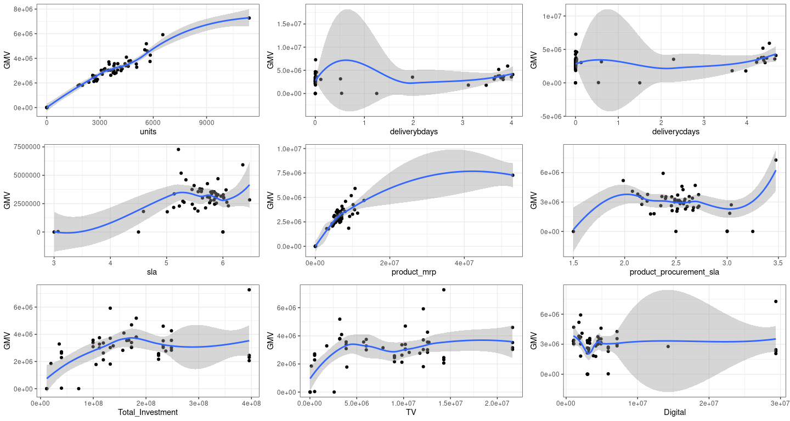<!-- -->

``` r
plot_grid(GA_plots1[[10]],GA_plots1[[11]],GA_plots1[[12]],GA_plots1[[13]],GA_plots1[[14]],GA_plots1[[15]],
               GA_plots1[[16]],GA_plots1[[17]],GA_plots1[[18]],align ="h")
```

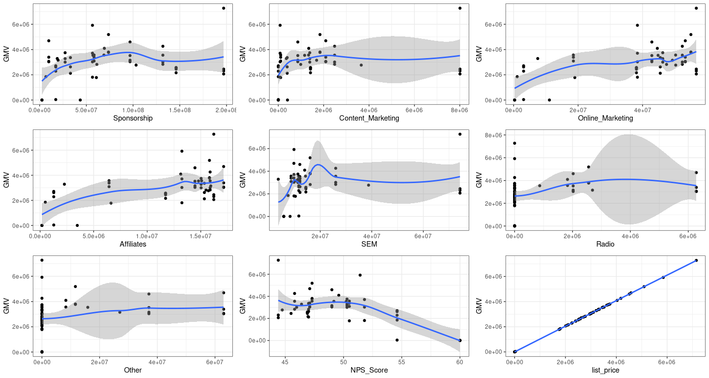<!-- -->

``` r
plot_grid(GA_plots1[[19]],GA_plots1[[20]],GA_plots1[[21]],GA_plots1[[22]],GA_plots1[[23]],GA_plots1[[24]],
               GA_plots1[[25]],GA_plots1[[26]],GA_plots1[[27]],align ="h")
```

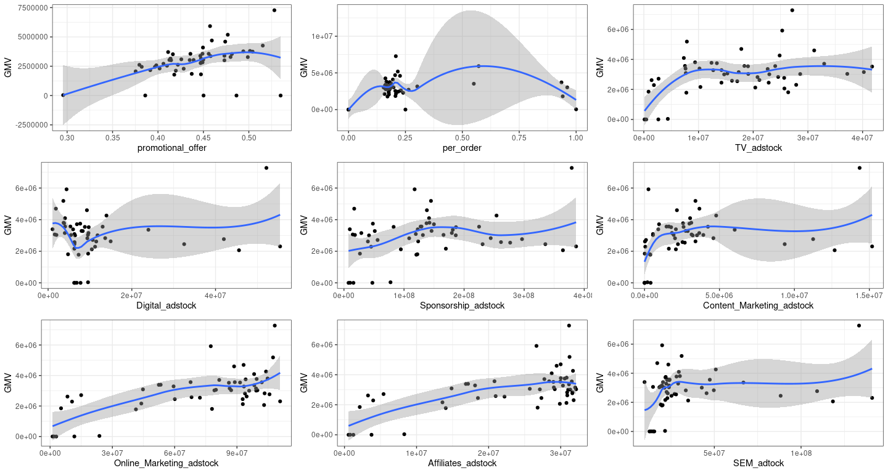<!-- -->

``` r
plot_grid(GA_plots1[[28]],GA_plots1[[29]],GA_plots1[[30]],GA_plots1[[31]],GA_plots1[[32]],GA_plots1[[33]],
               GA_plots1[[34]],GA_plots1[[35]],GA_plots1[[36]],align ="h")
```

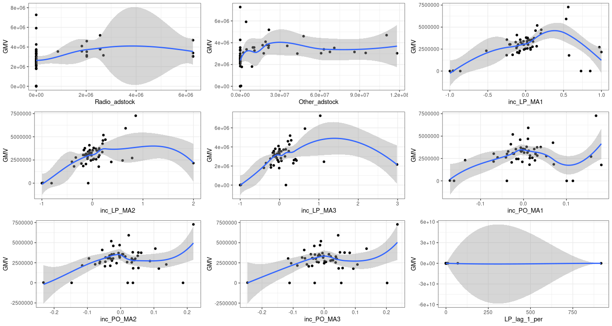<!-- -->

``` r
plot_grid(GA_plots1[[37]],GA_plots1[[38]],GA_plots1[[39]],GA_plots1[[40]],GA_plots1[[41]],GA_plots1[[42]],
               GA_plots1[[43]],GA_plots1[[44]],align ="h")
```

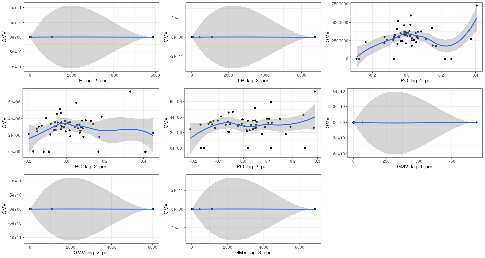<!-- -->

### **3. EDA for Sub-category :: HomeAudio \[gmv Vs Independent variables\]**

    ##            used  (Mb) gc trigger   (Mb)  max used   (Mb)
    ## Ncells  3892405 207.9    8441055  450.9  11985735  640.2
    ## Vcells 98228170 749.5  203636514 1553.7 203636514 1553.7

#### **3.1. Response Curves \[‘gmv’ w.r.t all the Independent variables\]**

``` r
HA <- HomeAudio_final[,c(2:19,21:32,63:77)]
```

##### **3.1.1. Plotting the scatter plot of all the Independent variables w.r.t ‘gmv’**

``` r
HA_plots1 <- list()  # new empty list

for (i in 2:45) local({
  i <- i
  p5 <- ggplot(HA,aes(x=HA[,i],y=HA[,1])) + geom_point() + geom_smooth(method = "loess") + theme_bw() + 
            labs(x= paste0("", colnames(HA[i])),y="GMV")
      
  HA_plots1[[i-1]] <<- p5  # add each plot into plot list
      
})
```

##### **3.1.2. Plotting all the graphs**

``` r
# Note: It takes few seconds to load, please hold in order to come up all the graphs
plot_grid(HA_plots1[[1]],HA_plots1[[2]],HA_plots1[[3]],HA_plots1[[4]],HA_plots1[[5]],HA_plots1[[6]],
              HA_plots1[[7]],HA_plots1[[8]],HA_plots1[[9]],align ="h")
```

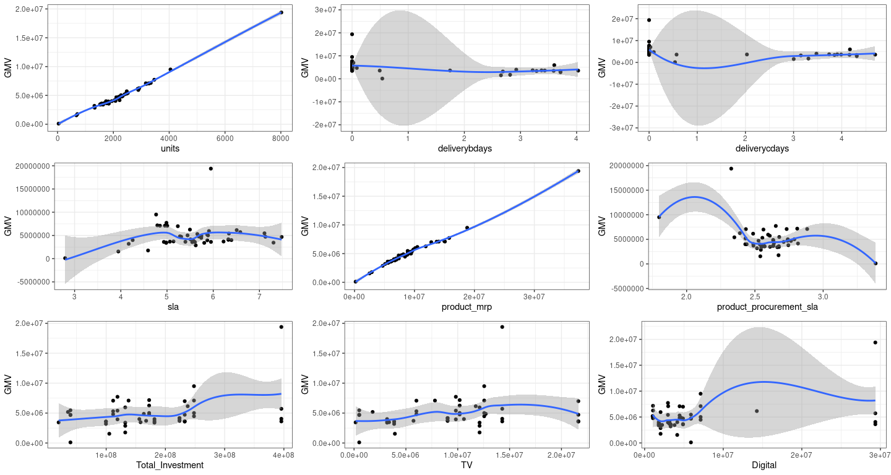<!-- -->

``` r
plot_grid(HA_plots1[[10]],HA_plots1[[11]],HA_plots1[[12]],HA_plots1[[13]],HA_plots1[[14]],HA_plots1[[15]],
              HA_plots1[[16]],HA_plots1[[17]],HA_plots1[[18]],align ="h")
```

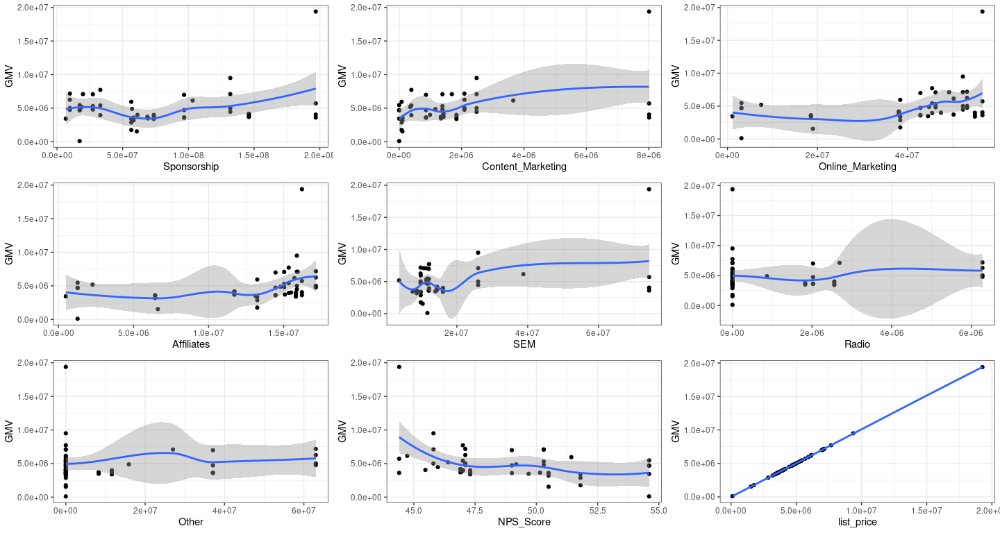<!-- -->

``` r
plot_grid(HA_plots1[[19]],HA_plots1[[20]],HA_plots1[[21]],HA_plots1[[22]],HA_plots1[[23]],HA_plots1[[24]],
              HA_plots1[[25]],HA_plots1[[26]],HA_plots1[[27]],align ="h")
```

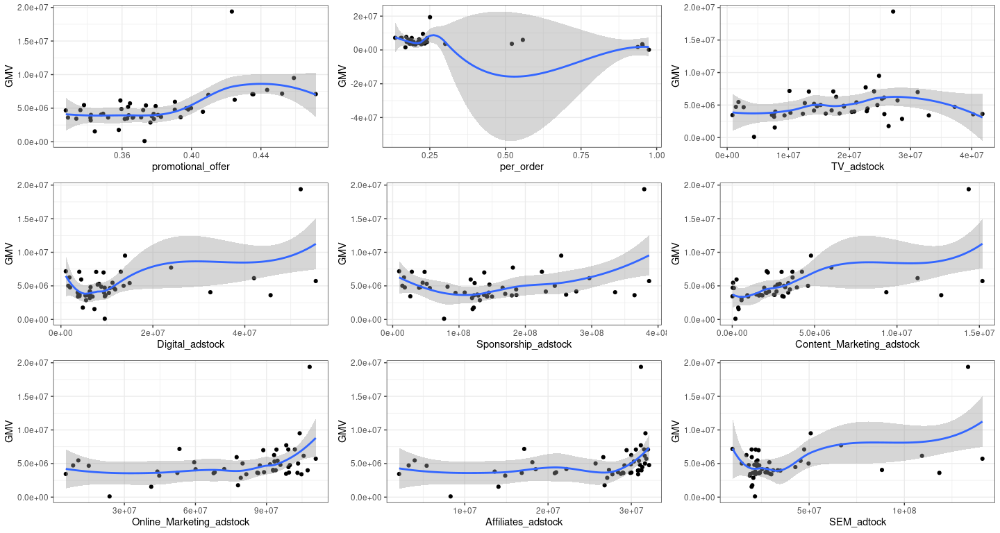<!-- -->

``` r
plot_grid(HA_plots1[[28]],HA_plots1[[29]],HA_plots1[[30]],HA_plots1[[31]],HA_plots1[[32]],HA_plots1[[33]],
              HA_plots1[[34]],HA_plots1[[35]],HA_plots1[[36]],align ="h")
```

<!-- -->

``` r
plot_grid(HA_plots1[[37]],HA_plots1[[38]],HA_plots1[[39]],HA_plots1[[40]],HA_plots1[[41]],HA_plots1[[42]],
              HA_plots1[[43]],HA_plots1[[44]],align ="h")
```

<!-- -->

### **4. EDA for Sub-category :: CameraAccessory \[gmv Vs Independent variables\]**

    ##            used  (Mb) gc trigger   (Mb)  max used   (Mb)
    ## Ncells  3924581 209.6    8441055  450.9  11985735  640.2
    ## Vcells 98305441 750.1  203636514 1553.7 203636514 1553.7

#### **4.1. Response Curves \[‘gmv’ w.r.t all the Independent variables\]**

``` r
CA <- CameraAccessory_final[,c(2:19,21:32,77:91)]
```

##### **4.1.1. Plotting the scatter plot of all the Independent variables w.r.t ‘gmv’**

``` r
CA_plots1 <- list()  # new empty list

for (i in 2:45) local({
  i <- i
  p6 <- ggplot(CA,aes(x=CA[,i],y=CA[,1])) + geom_point() + geom_smooth(method = "loess") + theme_bw() + 
            labs(x= paste0("", colnames(CA[i])),y="GMV")
      
  CA_plots1[[i-1]] <<- p6  # add each plot into plot list
      
})
```

##### **4.1.2. Plotting all the graphs**

``` r
plot_grid(CA_plots1[[1]],CA_plots1[[2]],CA_plots1[[3]],CA_plots1[[4]],CA_plots1[[5]],CA_plots1[[6]],
              CA_plots1[[7]],CA_plots1[[8]],CA_plots1[[9]],align ="h")
```

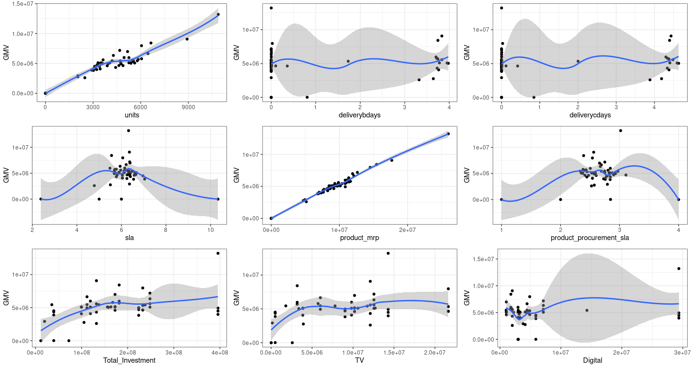<!-- -->

``` r
plot_grid(CA_plots1[[10]],CA_plots1[[11]],CA_plots1[[12]],CA_plots1[[13]],CA_plots1[[14]],CA_plots1[[15]],
              CA_plots1[[16]],CA_plots1[[17]],CA_plots1[[18]],align ="h")
```

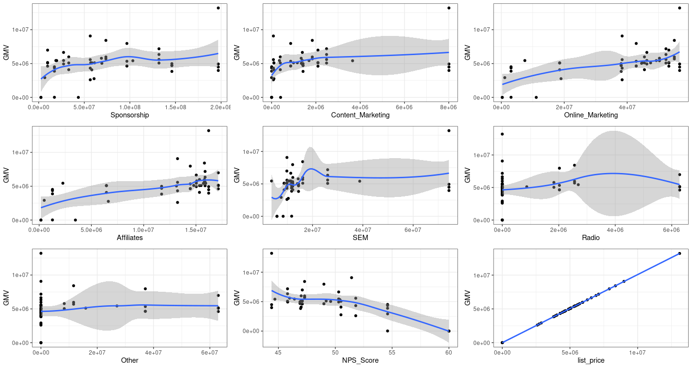<!-- -->

``` r
plot_grid(CA_plots1[[19]],CA_plots1[[20]],CA_plots1[[21]],CA_plots1[[22]],CA_plots1[[23]],CA_plots1[[24]],
              CA_plots1[[25]],CA_plots1[[26]],CA_plots1[[27]],align ="h")
```

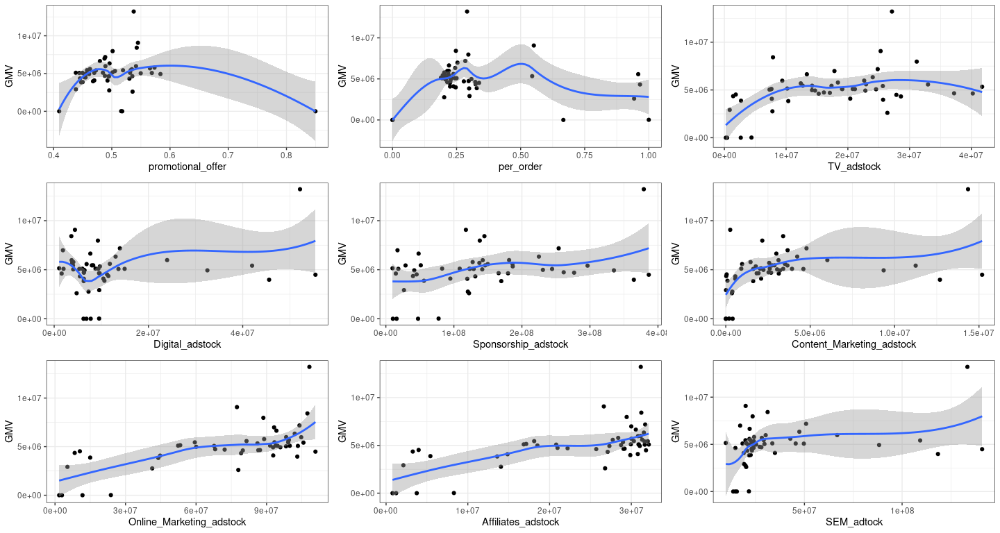<!-- -->

``` r
plot_grid(CA_plots1[[28]],CA_plots1[[29]],CA_plots1[[30]],CA_plots1[[31]],CA_plots1[[32]],CA_plots1[[33]],
              CA_plots1[[34]],CA_plots1[[35]],CA_plots1[[36]],align ="h")
```

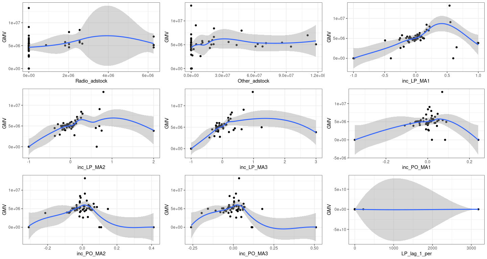<!-- -->

``` r
plot_grid(CA_plots1[[37]],CA_plots1[[38]],CA_plots1[[39]],CA_plots1[[40]],CA_plots1[[41]],CA_plots1[[42]],
              CA_plots1[[43]],CA_plots1[[44]],align ="h")
```

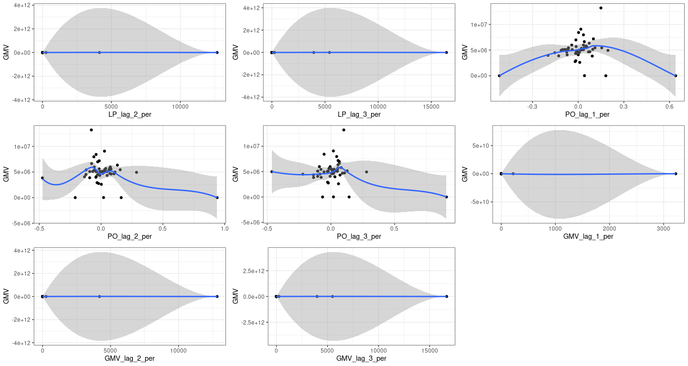<!-- -->
